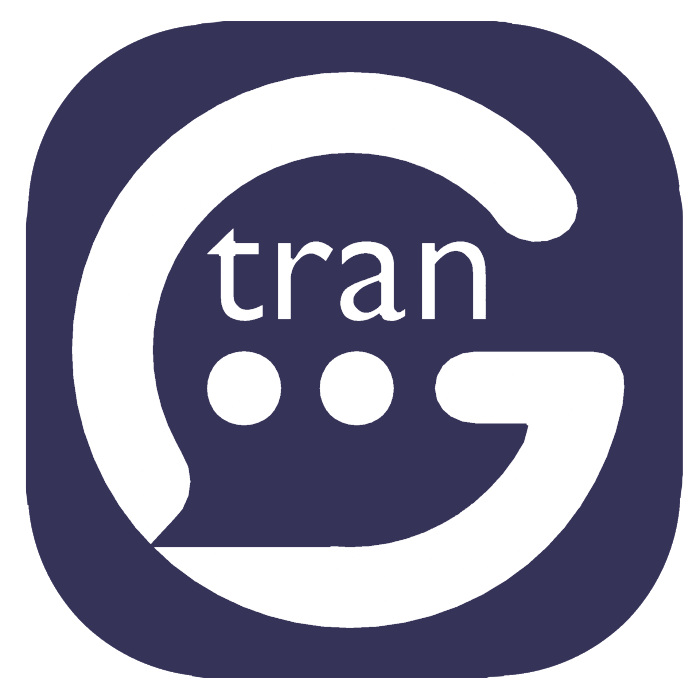

<p align="center">
  
</p>


[English](#en) · [中文](#zh-cn)

<a id="en"></a>

# Glossy

[](https://github.com/SpencerZXWu/Glossy/actions/workflows/ci.yml)

A lightweight desktop translation popup for Windows. Select text in any
application with the mouse and Glossy shows a small floating card with the
translation under the cursor.

- **Word or short phrase** → phonetic symbols, part of speech, definitions, one
  example, the inflections, the synonyms, the sentence it came from and a
  pronunciation button.
- **Sentence or paragraph** → a smooth translation into your target language,
  sentence by sentence when the two do not divide the same way.
- **A measurement or an amount** that the translation still writes in a unit
  your target language does not use → the converted value and the conversion
  rate, right in the card (`12 ft ≈ 3.66 m`). Currency rates are looked up live;
  every other unit is built into the app. Can be switched off in the settings.
- The source language is detected automatically.
- A selection that ends with sentence punctuation (`.`, `?`, `!`, `。` …) is
  always translated as a sentence, however short it is.
- Besides a selection, the text can come from the clipboard (**Ctrl+Alt+C**), from a
  rectangle drawn over the screen (**Ctrl+Alt+Q**), from a whole file, or from the box
  in the window itself.
- The translation can be written **back over the text it came from** — Ctrl+Enter in
  the card, or the button under its translation side — so a message being typed or a
  draft is translated without retyping it.

## Install

Download the latest release from
[Releases](https://github.com/SpencerZXWu/Glossy/releases/latest) and pick the
one that suits you:

| Download | What it is |
| --- | --- |
| `Glossy_<version>_x64-setup.exe` | The installer, and the one to use if you want the automatic update to work. Registers Glossy in **Installed apps**, so it can be uninstalled the usual way |
| `Glossy_<version>_x64_en-US.msi` | The same application as an MSI package, for anyone deploying it with a policy or an installer script |
| `Glossy_<version>_x64_portable.zip` | Nothing to install: unpack it anywhere and run `glossy.exe` from that folder. Keep `WebView2Loader.dll` beside it, and note that start with Windows remembers the folder you unpacked to, so leave it where it is |

Windows 11 x64; WebView2 is required and ships with current Windows builds. The
`SHA256SUMS.txt` in the same release lists the hashes of all three.

None of them is code-signed yet, so SmartScreen warns about an unknown publisher.
To build from source instead, see [Development](#development).

## Using it

1. Start Glossy. The settings window opens on the very first launch only —
   later launches start quietly in the notification area, and Glossy listens for
   selections from the moment it starts.
2. Closing that window does not quit Glossy — it keeps watching for selections
   in the background. Click the Glossy icon in the notification area (or pick
   **Open Glossy** from its menu) to bring the window back. That menu also
   carries the two actions that need no window — **Translate a screenshot** and
   **Translate the clipboard**, each naming the shortcut that does the same
   thing, so the keys are readable while the window is closed — and **Quit**
   stops Glossy. Translate the clipboard reads what is on the clipboard when the
   entry is clicked: the shortcut presses `Ctrl+C` first to pick up whatever is
   selected, which a menu click cannot promise. Starting Glossy while it is
   already running only shows a short notice. A silent start is announced by a
   small card in the bottom right corner; it fades away after a few seconds, and
   clicking it opens the settings window. Windows 11 keeps new notification area
   icons in the overflow menu (the `^` next to the clock) — drag the icon onto
   the taskbar, or turn it on under **Settings → Personalization → Taskbar →
   Other system tray icons**, to keep it visible.
3. In any application, **drag across text** (or **double click a word**) to select it.
4. Glossy shows a small Glossy icon below the selection. Nothing is translated —
   and nothing is charged against the day's allowance — until you **click that
   icon**, so a word you merely swiped over costs nothing. Clicking anywhere else
   makes the icon disappear.
5. The card appears below the selection. Drag its header to move it, press the
   **pin** button to keep it, open the settings from the header, press the **camera**
   to read a rectangle off the screen instead of a selection, or click
   anywhere else to dismiss it. Under each side of the card — the original and
   the translation — sit that side's own **copy** and **pronunciation** buttons, and
   the translation side carries one more: the button that writes the translation back
   over the text it came from, described under [Replace the original
   text](#replace-the-original-text) below. Opening the settings from the header leaves a
   pinned card where it is and takes an unpinned one away with it.
   A pinned card stays on screen until you unpin or dismiss it, and a new
   selection is translated straight into it instead of opening a second card.
   The row under the header shows the language pair: hover it and pick either side
   from the dropdowns to translate again with that language, or press the `⇄`
   button to translate the result back into the language it came from. The pair
   resets to *detect the source and use the configured target* for every new
   selection; a target you pick by hand is remembered and becomes that configured
   target, so the next selection already starts from it, while the source you
   pick is good for the card on screen only.
6. Selections shorter than the configured minimum (2 characters by default) are
   ignored, and a drag that starts or ends on the popup itself never triggers a
   translation.

A word card shows the phonetic symbols, the parts of speech with their definitions,
one simple example, and — in the same card — the inflections of the word, the words
that mean roughly the same, the sentence it was selected from with a translation of
that sentence, and a copy button plus a pronunciation button for each side of the
card. A sentence or a
paragraph is shown as the translation itself, with the original above it (capped at
four lines) and, for a long paragraph, a sentence-by-sentence view underneath.

Both shapes of card — the word card and the translation-only one — carry that original in
grey under the language row, and the grey text can be edited. Click it, correct what
Glossy was handed — a selection that came out wrong, a word that was meant to be a
different one — and Ctrl+Enter, or simply clicking away, translates the corrected text
instead. Nothing is sent while the caret is still in the field, and text left empty or
unchanged costs nothing. Esc puts the translated text back without closing the card.

Three combinations are registered with Windows, and each one works in every program — and
is taken away from every program while Glossy holds it. **Ctrl+Alt+C** translates the
clipboard content instead of a selection, **Ctrl+Alt+G** brings this window to the front,
and **Ctrl+Alt+Q** reads the text inside a rectangle you drag over the screen (see
[Read the screen](#read-the-screen) below) — the same thing the **camera** button in the card
does without the keyboard. Unlike a selection a shortcut translates at once —
there is no icon to click — into the card on screen, or into the pinned card when one is
open. All three are recorded under **General** in the settings window, and a field left empty
switches that shortcut off. Every button that does what one of them does names its combination
in its tooltip — the camera and the settings button of a card, and the screenshot button in
this window — and names the latest one, because the tooltip is built from what was recorded.
The window's own Ctrl+Enter (on the same page) is the opposite: it
exists only inside the Translate box of this window and never affects another program. The
card on screen has a Ctrl+Enter of its own — the write-back below — and that one is not a
setting either: it is registered with Windows while such a card is up and given back the
moment it closes, because Ctrl+Enter is what many programs send a message with.

The popup is a non-activating always-on-top window: it never steals the keyboard
focus from the application you are reading in. It is kept inside the work area of
the monitor the cursor is on, and flips above the cursor when there is no room below.
Its own controls answer the keyboard all the same: the caret going into the grey
original — by a click or by a Tab once the card holds the keyboard — is what asks for
the front, the ring then walks the card from its header down, the arrows walk the
engine menu at its foot, and closing the card hands the keyboard back to the program
the selection came from.

### Replace the original text

A card drawn for something you have just done — a selection, the text `Ctrl+Alt+C` picked
up, or the words a screen reading recognised — carries one more button under the
translation: clicking it puts the translation where the text you selected used to be. The
same write is made with **Ctrl+Enter** while such a card is on screen, which is what the
button promises on hover. It is there for the work that is not retyping: a message being
typed, a chat box, a draft, translated in place.

The write is a paste and not an edit. Glossy puts the translation on the clipboard and sends
`Ctrl+V` to the program in front, which is the one the text came from — the popup never took
the focus, so that program still has it, and the caret or the selection in it is what the
paste lands in. Your clipboard is then put back the way the **Put the clipboard back after
reading a selection** setting asks, and the button reports how it went: **Original
replaced**, or **The original could not be replaced** when the paste was refused — an
elevated window, a field that is not editable any more, focus that moved on in the
meantime. The write blocks for a moment while the other program reads the clipboard.

Ctrl+Enter here is not one of the recorded shortcuts, and it is deliberately short-lived:
Ctrl+Enter is what many programs send a message with, so it is registered with Windows only
while a card that has something to write over is up, and released the moment that card goes
away. That is also why the button is missing where there is nothing behind it — a card shown
along with a translation from the **History**, and the card inside the window, whose text is
still in the box it was typed in.

### Settings

The window is a sidebar plus the one page it opens. **Features** comes first, and none of
it is a setting: **Translate text** is the popup's translation inside the window,
**Document** is still being built — its entry is greyed out, the page cannot be opened and
the backend refuses every request it makes — **OCR** starts a screen reading, and
**Wordbook** sits in this group too. Under **Settings** every group has its own
page — **General**, **Resources**, **Language**, **Appearance**,
**Reading**, **Units**, **History**, **Files and logs**, **Updates** — and the window
reopens on the page it was left on. **General** holds three blocks: the master switch and
the trigger options, the three global shortcuts, and the trigger details (shortest
selection, ignored programs, source languages); the page spells out that a global shortcut
is registered with Windows and works everywhere, while the keys under **Only in this
window** exist only while this window has the keyboard focus. Every shortcut is recorded
rather than typed — click the box and press the combination — and each field reports at
once whether Windows took it. Tab and `Esc` leave a box that is recording without changing
anything, so the keyboard is never held by it. **Resources** downloads and removes the files that have to be
on this machine to work offline: the reading engine, the languages it can read — as many of
them checked at once as the user meets, with a screenshot read by all of them and each line
kept from the one that read it best —
and the offline translation pack, which is what translates when there is no
network at all. Each one says
where it comes from and under which licence, and the full texts of those
licences are in [THIRD_PARTY_NOTICES.md](./THIRD_PARTY_NOTICES.md), which the
installer puts next to the app.

| Option | Meaning |
| --- | --- |
| Interface language | `Follow Windows`, `简体中文` or `English`. Switches the settings window and the popup immediately. |
| Enable selection translation | Master switch. Turning it off pauses the global selection capture immediately. |
| Start Glossy with Windows | Adds a `--autostart` entry to `HKCU\...\Run`, so Glossy is already waiting in the notification area after a login. Started that way it does not show the "Glossy is running" card. |
| Translate when the mouse drags across text | Enables the drag gesture. |
| Translate a word on double click | Enables the double-click gesture. |
| Put the clipboard back after reading a selection | Restores your previous clipboard content after Glossy copied the selection. |
| Show the original text in the popup | Hides the source line in the card when off. A long selection is capped at four lines there and scrolls inside its block, so the translation keeps the room. |
| Convert units and currency | When the translation still measures something in a unit your target language does not use — feet, pounds, °F, a foreign amount — the card adds the converted value and the rate underneath (`12 ft ≈ 3.66 m` / `1 ft = 0.3048 m`). The numbers are read from the translation, because the translator is what decides whether a symbol is a unit at all and always writes it in a language the tables know; if the translation holds none, the original is read instead. Length, mass, volume, speed, area and temperature convert inside their category, and the target unit is the one a person would write; the target currency follows the target language (`zh-CN` → CNY, `en` → USD). Currency rates come through Glossy's own server, which reads `open.er-api.com` and falls back to ECB (`api.frankfurter.app`); the app asks those two directly only when the server cannot answer, and either way a rate is cached for six hours. Everything else is built into the app. Off means no conversion and no rate request. |
| Show the sentence a word was selected from | The card adds the sentence the selection was taken from, next to a translation of that sentence. Off means the word is translated on its own. |
| Pair the original and the translation sentence by sentence | A paragraph whose translation divides differently is listed one aligned row at a time instead of as a block. A translation that comes back as a single row is left as the plain paragraph. |
| Draw a compact card, without the extras | Keeps the translation, the phonetic symbols and the meanings, and leaves out the example, the inflections, the synonyms, the context sentence, the sentence-by-sentence view and the conversions. |
| Speaking rate | How fast the pronunciation buttons read a text out: `Slow`, `Normal`, `Fast` or `Very fast` (Windows SAPI). The voices are the ones Windows already has, and the language of the text picks the voice. |
| Shortest selection to translate | Character count below which a selection is ignored (`1`–`40`, default `2`). |
| Translate the selection | Combination registered with Windows that translates from any program — the selected text, or the clipboard content when nothing is selected — `Ctrl+Alt+C` by default. Click the box and press the combination instead of typing it, so it cannot be misspelled; `Record` reopens the box, `Clear` switches this shortcut off. Glossy registers it immediately and the line under the field shows the registered combination, the clash it found, or why Windows refused it. |
| Open this window | Combination that brings the settings window to the front from any program (`Ctrl+Alt+G` by default), whether it was hidden in the notification area or minimised. Same field, same rules, and a field left empty registers nothing. |
| Read the screen | Combination that starts a screen reading from any program (`Ctrl+Alt+Q` by default): the screen freezes, a rectangle is dragged over the text to translate, and `Esc` or a right click cancels. Same field, same rules. |
| Never translate in these programs | A list of process names (`idea64.exe`, `mstsc`) in which selection capture is skipped. Add one by typing it (the `.exe` suffix is optional — the `Add` button normalises it), by choosing it from the dropdown of currently running programs, or by pressing `Pick with the mouse` and clicking the window to ignore. Each entry has an `×` to remove it; duplicates are dropped case-insensitively. |
| Only translate these source languages | A list of languages, e.g. `English` and `日本語`. Empty means every language triggers a translation. A selection whose language cannot be pinned down — mixed scripts, digits, a word half a dozen languages share — is always let through, so a wrong guess never swallows a selection. The list is stored as a `sourceLangs` array. |
| Colours | `system` follows the Windows light/dark preference; `light` and `dark` force one scheme in both windows. A Windows contrast theme is not one of these entries: with one on, both windows take the system colours on their own, and the choice comes back when the theme is turned off. |
| Text size | Multiplier for every text size in the popup (`90 %`–`150 %`). |
| Width | Popup card width (`300`–`520` CSS px). |
| Opacity | How see-through the popup card is (`100 %` solid down to `50 %`). The card fades while the text stays readable on top of whatever is behind it. |
| Close by itself | Seconds before the popup hides on its own; `Never` keeps it open until dismissed. |
| Close the popup right after the translation is copied | Hides the card once the copy button was used. |
| Target language | Language the result is translated into. |
| History | How many finished translations to remember (`Off` to `The last 500`, default 50). The list below the selector keeps the original, the translation, the provider and the time; `Search` filters both texts, clicking an entry shows it in the floating card again (no second provider call), and each entry has a copy and a remove button. `Forget everything` empties the list. The file lives in `%APPDATA%\com.glossy.translator\history.json`. |
| Settings file | `Export…` writes `Documents\glossy-settings.json`; `Import…` reads a file you pick back into the app. The file holds the choices and nothing secret — there is no key field left anywhere, so an export never asks about one. An import validates through `sanitized()`. The same page, under **Files and logs**, shows where `glossy.log` is and how much it holds, with `Open the folder` and `Clear` beside it. |
| Updates | Prints the version this copy is, above the buttons. `Check for a new version when Glossy starts` asks GitHub Releases on every start (off by default). `Check now` looks immediately and says which version is waiting, and `Download and restart` installs it. A build without an update signing key — which is every build until the release key pair exists — hides the buttons, says so, and ends that line with the address of the releases page (`github.com/SpencerZXWu/Glossy/releases/latest`), which opens in the browser when it is clicked: that is the way to a new build while this one cannot update itself. |
| Translation service | Which service translates: `cloud-baidu` (Glossy's own server, translating with Baidu — nothing to fill in), `cloud-youdao` (the same server, translating with Youdao — nothing to fill in either), `google` (the free public endpoint, no key), or `offline` (the models on this machine, downloaded from the Resources page — no connection and no allowance). A new install starts on `cloud-baidu`. Stored as `service`, see below. |
| Ask another service when the chosen one fails | The service picked above is always tried first and cannot be moved; the list under it holds every other engine once, in the order the arrows put them in — changing the chosen service therefore changes the list, so no engine is ever listed twice and none is left out. Turning the switch off means a failure is shown as a failure. When another engine had to answer, the card's footer names it and the line under it names the engine that did not answer, with the reason the relay gave when it was the relay that moved on (`its allowance is used up`, `the server's account with it was refused`, …); the same line is written to `glossy.log`. |
| Allowance line (`cloud-baidu`, `cloud-youdao`) | Shown only for the two server-backed entries: what is left of today's allowance — or the reason the server could not be reached — with a `Check again` button next to it. It is written on every page a translation is started from — **Language**, **Translate text** and **OCR** — because that is where a reader wants to know what is left before spending it. The address itself is part of the build rather than a field, so nobody can break the one service that needs nothing set up; see [`server/`](./server/README.md) to run a deployment of your own. The allowance is counted by an install id, which is derived from the machine rather than drawn at random: an id drawn at random is drawn again on the next install, and the allowance would start over with it. Screenshot translation asks no server for anything, so it spends none of this allowance: the reading happens on this machine. |

Every shortcut accepts `Ctrl`/`Control`, `Alt`, `Shift`, `Win`/`Meta` plus one key:
a letter, a digit, `F1`–`F24`, `Space`, `Enter`, `Tab`, `Esc`, `Backspace`,
`Delete`, `Insert`, `Home`, `End`, `PageUp`, `PageDown` or an arrow key. At least
one modifier is required. When Windows rejects the combination — usually because
another program already owns it — the reason is shown under the field and that
shortcut stays inactive until the setting is corrected; the others are unaffected.

If the clipboard holds no text at all, the translate shortcut falls back to copying the
current selection, so "select text, press the shortcut" works as well.

### Providers

Every entry in the dropdown works without an account of your own: `google` asks
a public endpoint, `offline` asks this machine, and the two server-backed
entries are answered by a Glossy deployment that holds the vendor account, so no
key ever reaches the app. They only name the engine the server should translate
with, and it falls back to another one when that engine cannot answer.

| Provider | Cost | Notes |
| --- | --- | --- |
| `cloud-baidu` | nothing to fill in | **Baidu Translate**: a server deployed from [`server/`](./server/README.md) does the translating with the project's own account, named `vendor: "baidu"` on the wire. The app only sends the text plus an install id, the credentials stay on the server, and it works from mainland China. The daily allowance is counted per device, per address and in total, and the settings window shows what is left of it; running your own deployment is a one-line change of the address inside the build. |
| `cloud-youdao` | nothing to fill in | **Youdao Translate** — the same server, asked to translate with 有道智云 (`vendor: "youdao"` on the wire). Nothing to fill in either, and the same fallback when Youdao cannot answer. |
| `google` | free, no key | Public `translate.googleapis.com` endpoint. Blocked on some networks, including much of mainland China. Always queried with the `dict-chrome-ex` client id; the throttled `gtx` id is only used as a fallback. |
| `offline` | 244 MB, downloaded once | **OPUS-MT on this machine.** `opus-mt-en-zh` (Helsinki-NLP, Apache-2.0, int8) and `opus-mt-zh-en` (Helsinki-NLP, CC-BY-4.0, int8) run through the same ONNX Runtime the recogniser uses, so the text never leaves the computer and there is no allowance to count. Chinese and English both ways and nothing else, which is what the two models were trained for. The two directions are downloaded **one at a time** on the **Resources** page — each is about 114 MB and is a whole translator on its own, so one way round never waits for the other — and until it is there, choosing this entry answers with an error that says so. A sentence takes a second or so, which is the price of not asking anybody. |

Every engine translates a different set of languages: a standard Baidu account
refuses eight of the 31 Glossy offers (`uk`, `tr`, `hi`, `id`, `ms`, `he`, `no`,
`sk`), Youdao and Google take all of them, and the offline pack takes `en` and
`zh-CN`. Both language bars list only the
languages of the engine the card is using, so one it would refuse is never offered
and never sent.

Phonetics and definitions for single words come from `api.dictionaryapi.dev`, which is free,
needs no key and is reachable from mainland China. The Google endpoint is only asked for
details the selected provider did not return.

### Free quotas and commercial use

The free tiers differ in what they permit. What they forbid is handing the raw
quota — a key, an interface — to other people or reselling it; keeping the
credential on a server of our own and letting the app call that server is a use
of the quota by the account holder, which is why the two server-backed entries
relay it that way:

- **`cloud-baidu` / `cloud-youdao`** — they translate through an LLM account the
  project pays for, and
  fall back to Baidu credentials when no such account is configured, so what they
  make are paid calls and the terms above do not apply to them. No user ever sees
  or holds a vendor key: the app sends the text plus an install id, and the server
  meters a daily allowance per device and address.
- **Zhipu** — 用户协议 §非付费功能 licenses the free models for *非商业的、个人研究学习* use
  only. Fine for personal use; not fine for a published or paid product.
- **ModelScope API-Inference** — explicitly 非商业化, 非盈利.
- **Aliyun 机器翻译** — the monthly free quota is explicitly 仅适用客户试用场景.
- **Tencent 腾讯云 TMT** — the free 5M characters/month quota is still advertised, but the
  service no longer offers text translation: as of the 2026-03 and 2026-07 releases the
  `TextTranslate`, `TextTranslateBatch`, `ImageTranslate`, `LanguageDetect` and
  `SpeechTranslate` actions were removed and the API 概览 lists only `ImageTranslateLLM`.
  The 计费概述 page is stale, so do not plan on it.
- **Baidu 翻译开放平台** — 50k characters/month unverified, 1M personal-verified, 2M
  business-verified. Its terms are silent on commercial use, but 服务协议 forbids a *client
  program* from caching Baidu translation data and forbids resale. Glossy does not cache
  anything, so this does not bite; a fork that adds a cache would need to revisit it.
  Quotas are QPS-limited to 1 / 10 / 100.
- **Volcengine 火山引擎** — 2M characters/month, but onboarding requires a sales contract.
- **NiuTrans 小牛翻译** — 200k characters/day after registering; commercial terms unpublished.
- **SiliconFlow** — `tencent/Hunyuan-MT-7B` is free, but the platform terms are silent about
  free models and are restricted to internal business purposes.
- **Fully offline** — `Opus-MT` weights are Apache-2.0 (`opus-mt-en-zh`) and
  CC-BY-4.0 (`opus-mt-zh-en`), both commercial OK, ~113 MB int8 per direction and
  ~300 MB RAM. This is what the `offline` channel ships: both directions as int8
  ONNX, run through the ONNX Runtime the recogniser already downloads.
  `NLLB-200` is CC-BY-NC-4.0 and must
  **not** be shipped.

Settings are stored as JSON in `%APPDATA%\com.glossy.translator\settings.json`.
Failures are written to `glossy.log` in the same folder, capped at 256 KB: a full log
becomes `glossy.log.1` and a new one is started, so a machine that runs for months leaves
two bounded files rather than one that grows without end. Both are reachable from
**Files and logs** in the settings window. The log is written because a release is linked as
a Windows GUI application and therefore has no console: what the app printed before was
thrown away, and this is where it lands instead.
The file opens with `formatVersion`, which says which shape it is written in; from
`1.3.0` onwards the keys are only ever added and the IPC command names do not move, so
a file written by an earlier build keeps loading. A file this build cannot read — one
that is not a JSON object, or one written by a newer format version — is copied to
`settings.backup-<unix seconds>.json` next to it and the app starts from the defaults,
rather than being overwritten.
The `firstRun` flag in that file records that the welcome window was already
shown; removing it (or the whole file) brings the window back on the next start.
There is no credential in the file, and no field anywhere in the app to type one
into: every service the dropdown offers works without an account of your own, so an
export can never carry a key. The `credentials`, `apiKey`, `appId` and
`cloudEndpoint` keys a `1.x` file may hold are dropped the next time the settings are
saved, and a key that was in one is neither used nor disclosed — an old file loses
the key along with the mode that asked for it. [COMPATIBILITY.md](./COMPATIBILITY.md)
is the whole of that migration, key by key.
The ignored-program list is stored as an `ignoredApps` array; a legacy
comma-separated string is accepted and split on load.
Which service translates is stored as `service`, one of `cloud-baidu`,
`cloud-youdao`, `google` or `offline`; a fresh install starts on `cloud-baidu`.
A `1.x` file spelled the same choice across four keys — `channel`, `cloudProvider`,
`cloudVendor` and `provider` — because the app used to offer a provider of your own
with your own key, and a relay at an address you typed in. Format version `2` folds
what is left of that into `service`, and the next write drops the four keys together
with `cloudEndpoint`. A file written by an older build still keeps working: one with
no `channel` reads as the API channel it already was, a `cloudVendor` that is not
`youdao` reads as Baidu, and a `provider` this build no longer offers — Baidu with
one's own key, Zhipu, DeepL, OpenAI — reads as `cloud-baidu`.

### Translate inside the app

The first entry of the sidebar — **Translate text**, under *Features* — holds the
same translation feature as the popup: a text box for typing or pasting text. Select a word, a phrase or a sentence in that
box — or press **Translate** (Ctrl+Enter) to use the whole text — and the result
appears right below, in a card identical to the popup one: the source/target
language bar with its swap button, the copy button and the same word/sentence
rendering. A pasted text is translated as soon as it lands, whether it arrives
through **Paste** or through Ctrl+V; **Clear** empties the box and takes the card
away. The switch on the heading turns unit conversion on and off for the whole
app: it is the same setting as the one in the **Units** page, and it is the
one place where the conversions of a card can be flipped on the spot. The
language bar follows the popup rules, so the source starts on *Detect language*,
the target follows the configured language, and a new selection resets the pair
(the source override is never saved; the target you pick is, and becomes the
configured language). Press **Show in floating popup** to open the
real popup with the current selection (or with the whole text when nothing is
selected) — this exercises the popup without the global hook.

### Read the screen

The entry under *Features* called **OCR**, whose page is headed **Screenshot translation**, is
the keyboard-less form of the screen-reading shortcut: press the button there, press the
**camera** in a card that is already on screen, or `Ctrl+Alt+Q` in any program, and the screen
freezes under a dimmed overlay. Drag a rectangle over the text you want. The region is cut out of a
screenshot that was taken before the overlay was drawn — so the overlay itself can never end
up in the recognised text, and a card that was up is taken off the screen for that moment
too — and it is recognised **on this machine**: PP-OCRv4 on ONNX
Runtime, downloaded and removed on the **Resources** page. The picture never leaves the
machine, a reading costs nothing, and it works with no connection at all. What comes back is
translated by the ordinary popup path: the same card, the same service order, the same daily
allowance, the same history entry as a selection. The card is put up as soon as the
rectangle is let go — naming the engine, or saying that the reading engine is being fetched —
and the translation takes its place, so the screen is never empty while the picture is read.

`Esc`, a right click, or a rectangle too small to hold anything cancels without a request.
The overlay also puts itself away after 30 seconds, and pressing `Ctrl+Alt+Q` again while it
is up closes it, so a screen covered by it is never a screen that cannot be used again.
Reading the screen needs the reading engine, and the recognition is per language: Chinese and
English, Japanese, Traditional Chinese, the Latin-script languages, the Cyrillic ones and
Korean are each a pack of its own on the **Resources** page. Every one of them that is checked
reads the same screenshot — the detector runs once and each line is kept from the language
that read it best — so a picture holding Japanese and English comes back right without saying
which it is. A pack reads its own script and nothing else, and the Chinese-and-English pack
writes no kana at all, which is why the languages are checked rather than guessed. The first
screenshot asks before anything is downloaded — about 33 MB for the engine and that first
language — and the files are kept in `%APPDATA%\com.glossy.translator\ocr`. A machine without
them says so instead of translating, and every language after the first is two more files of
its own rather than a second engine.

All of it is Apache-2.0: the models are PaddleOCR's PP-OCR, distributed as ONNX by
RapidOCR, and they are named with their source, their licence and their SHA-256 in
[THIRD_PARTY_NOTICES.md](./THIRD_PARTY_NOTICES.md).

### Subtitles (in development)

The **Subtitles** page is the second thing Glossy does without a shortcut, and the first
thing it does that keeps looking at the screen by itself — which is why it is hidden until
**developer mode** is turned on, on the **Updates** page. Type the key into *Key* and press
**Turn on**; the page appears in the sidebar with a *Developer* mark, and **Turn off** on
the same page puts it away again, closing the page with it. The key is compared inside the
app rather than in the window, and the switch is one line in `settings.json`
(`developerMode`). With it off, nothing about Glossy is different from the release before
this one.

On the page, pick what the subtitles are written in and what they are read in, and the one
recognition language the region is read with. That last list holds the packs that are
already on the disk, because a reading runs every second: reading the region with one
recogniser costs a fraction of what reading it with every checked language costs, and a
subtitle is only ever written in one of them. Then press **Pick the area and start** and
draw two rectangles: the area the subtitles appear in, and the place the translation is to
be drawn. `Esc` or a right click cancels either one.

From then on Glossy reads that area about once a second. When what it reads changes, it is
translated and the translation is drawn in the second rectangle — a window that is exactly
that box, transparent, always on top and taking no clicks, so the line is never in the way
of the video. Nothing is uploaded to read the region: it is the same PP-OCR engine the
screenshot translation uses, on this machine, and only the text that comes back goes to the
translator through the same service order and the same daily allowance as everything else.
The settings window stays where it is while the reading runs — that is where **Stop** is — so
the page it was started from is the page the reading is stopped from. It is also the page the
boxes are named from:

Both boxes wear a faint dashed frame — the one the subtitles are read from, and the one the
translation is drawn in — so a region that is invisible by nature can be seen and aimed at.
Neither frame takes a click. To move or resize either box, use **Move the boxes** on the
page, or *Adjust the subtitle boxes* on the tray menu: that is one click away whether the
settings window is in front, behind the video or closed to the notification area. Both boxes
then appear over the video, dragged by their middles and resized by their eight handles;
`Esc` leaves them as they were. The reading carries on with the boxes it is given — the next
line is read from the new area and drawn in the new place.

### Translate a document (in development)

The **Document** entry is not finished, so it is closed: its sidebar entry is greyed out,
the page cannot be opened, and the backend refuses every request it makes — nothing is
translated and nothing is charged. What follows is what it will look like when it is done.

The entry translates a file rather than a selection.

Drop the file on the box, or use **Choose a file…**: a plain text file (`.txt`, `.text`),
Markdown (`.md`, `.markdown`), a subtitle file (`.srt`), a PDF or a Word document
(`.docx`). It is read locally, so the page can say how many pieces and how many characters
would be translated and show the opening of the first piece, without a single request.
Anything else dropped on the box is refused with a message rather than sent anywhere.

The language bar under the box is the source and the target of the run, with the `⇄` button
between them. It follows the popup rules: the source starts on *Detect language* and the
target on the configured **Target language**, and both can be changed here. Swapping is for a
file whose language you set by hand — there is nothing to swap while the source still says
*detect it*. The pair, the advanced settings and the folder are remembered for the next time
the window is opened.

**Advanced settings** folds open with three things:

| Option | Meaning |
| --- | --- |
| Leave the pieces that hold no letters as they are | On by default. A piece that carries no letters — a separator line in a subtitle file, a run of punctuation — is kept as it was found instead of being sent off and possibly coming back changed. |
| Save the translation as soon as it is finished | Off by default. With it on, a finished run writes the file itself and there is nothing left to press. |
| Longest piece sent in one request | `200`–`1500` characters, `1500` by default. A piece never crosses it, which is what keeps a request inside what the service accepts; a shorter piece means more requests. |

**Save the translation into** shows where the result goes: **Desktop (the default)** until
**Change…** picks another folder. **Translate the file** starts the run — at most 1500
characters per request and at most 60 000 characters per document — and the progress bar, the
count and the growing preview follow it. A failure stops the run rather than leaving a hole
in the middle of a document, and the same button starts it again. **Cancel** stops between
requests and reports how far it got; nothing is saved and the file that was read is
untouched. **Save the translation** appears once a run has something to save, and writes
`<name>.<target language>.<ext>` into the chosen folder — `report.zh-CN.md` for a file called
`report.md`.

Only the prose is sent. Markdown keeps its code fences, its front matter, its heading marks
and its list bullets, and a subtitle file keeps its cue numbers and time codes, so the
result can be read or played back in place of the original. A file that is not UTF-8 — with
a byte order mark, or in the system code page — is decoded rather than refused, and a mark
that came in with the file goes out with the translation.

A **PDF** is read into the words of its pages without a layout engine: the lines a paragraph
was wrapped over are joined back together and the text is translated as text, so the saved
answer is a `.txt` beside the original. A page that holds a picture of the words rather than
the words, as a scan does, is refused before anything is sent. A **Word** document (`.docx`)
is taken apart paragraph by paragraph — headers, footers and notes as well — and the
translation is written back into a copy of the same document: the translated text takes the
place of the runs that held the source in that paragraph, so styles, tables, pictures, page
setup and everything else are the ones the reader already knows, and the saved file is a
`.docx` that opens in Word as it was. An older `.doc` has to be saved as `.docx` first.
Both are read and written in process, with no service and no network involved.

### Troubleshooting

- **"Google Translate is rate limiting requests right now"** — Google answered `429`, which
  happens to desktop HTTP clients on the public endpoint even though a browser or `curl` still
  works. Glossy first retries with a second client id; if the message stays, wait a minute or
  switch the service to one of the other two entries in the dropdown.
- **"Could not reach Google Translate"** — the free `google` provider calls
  `translate.googleapis.com`, which is blocked on some networks (including much of mainland
  China). The card offers a retry button; if it keeps failing, switch to `cloud-baidu` or
  `cloud-youdao` (nothing to fill in).
- **"The free cloud translation quota for today is used up"** — the two server-backed
  providers count
  the characters they translate per device, per address and in total, and one of those counters
  hit its daily cap. It starts over at 00:00 UTC. Pick another entry in the dropdown, or deploy
  your own server from [`server/`](./server/README.md) and point the app at it.
- **"Screenshot translation needs the local text recognition engine."** — the machine has no
  recognition engine, and the download was turned down. Use the **Download** button on the
  **Resources** page; it is about 33 MB, it stays on this machine, and nothing about the
  picture is uploaded. Deleting it there gets the space back.
- **"Baidu rejected the APP ID" / "Baidu rejected the signature"** — the two halves of the
  credential pair were swapped or mistyped. `baidu` needs the APP ID in the first box and the
  密钥 in the second; the key is never sent to Baidu, it only signs the request.
- **"Baidu rejected this computer's IP address"** — the app's IP whitelist in the Baidu
  console is filled in. Either clear it or add the address Glossy dials from.
- **"`C:\…` is not a folder Glossy can save into; pick another one."** — the folder chosen
  under **Save the translation into** is gone, is not a folder, or refuses to be written to.
  Pick another one with **Change…**; the Desktop is what a document translation falls back
  to when none was chosen.
- **"The original could not be replaced"** — the paste behind the replace button was
  refused: the program in front cannot be pasted into, or it no longer has the focus. The
  translation was left on the clipboard, so it can be pasted by hand.
- **The popup shows "Paused"** although translations are enabled — the master switch
  in the settings window is off, or the settings file could not be read at start-up.

## How the selection is captured

Glossy installs a `WH_MOUSE_LL` hook and watches for left button press/release
pairs. The hook callback only records coordinates; a worker thread decides whether
the gesture was a drag or a double click, copies the selection with `Ctrl+C`
(sending `Ctrl+Insert` when the foreground window runs elevated), restores the
clipboard if requested, and finally tells the popup window what to show. The
captured text only ever goes to the translation service you selected — a vendor
endpoint for `google`, and the server the
project runs ([`server/`](./server/README.md)) for the two server-backed entries.

A gesture only opens the card when it really selected something. The release
point is checked first: a double click on a shell surface — a desktop icon, the
taskbar, the Start button — is ignored, so whatever the shell last put on the
clipboard is never translated. The copied text has to hold a letter and must not
look like the path of a file or folder, and a copy of files in Explorer counts as
no selection at all. When `Put the clipboard back after reading a selection` is
on, the previous content is restored once the application that was copied from has
stopped writing — it is checked again for up to 80 ms — so a late write cannot
leave the copied text behind. Glossy remembers the sequence number of every write
it makes itself and skips those while waiting for the `Ctrl+C` to land, so putting
the clipboard back can never be read back as a selection of its own.

## Development

### What you need

| Tool | Version | Notes |
| --- | --- | --- |
| Node.js | 18 or newer | only for the Tauri CLI; the frontend has no bundler |
| Rust | stable, `1.77` or newer | the GNU target `x86_64-pc-windows-gnu` — see below |
| `rustfmt` + `clippy` | same toolchain | `rustup component add rustfmt clippy` |
| MinGW-w64 | 8.1 or newer | the linker for the GNU target; on `PATH` as `gcc.exe` |

```powershell
rustup toolchain install stable-x86_64-pc-windows-gnu --component rustfmt --component clippy
rustup default stable-x86_64-pc-windows-gnu
npm.cmd install          # npm.ps1 is blocked by the default execution policy
npm.cmd run tauri dev    # dev build with hot reload of src/
npm.cmd run tauri build  # release build (installer + MSI + .exe)
```

`scripts\dev.cmd` is the dev command in a file that can be double clicked: it checks that
`cargo` is on `PATH`, installs the Tauri CLI when `node_modules` is missing, refuses to start
while another Glossy is running — a second one would install a second mouse hook — and keeps
the console open with the dev log. Running
`powershell -ExecutionPolicy Bypass -File scripts\make-shortcut.ps1` once puts a shortcut to
it on the desktop.

`npm.cmd run icon` regenerates `src-tauri/icons` from `assets/`.

`npm.cmd run tauri build` writes the NSIS installer to
`src-tauri\target\release\bundle\nsis\Glossy_<version>_x64-setup.exe`, the MSI to
`src-tauri\target\release\bundle\msi\Glossy_<version>_x64_en-US.msi` and the
standalone binary to `src-tauri\target\release\Glossy.exe`. Both bundlers need a
network connection the first time they run, to download their tooling — WiX for the
MSI, NSIS plug-ins for the installer — into `%LOCALAPPDATA%\tauri`.

The portable zip is not a Tauri target, since Tauri has none: `scripts\release.ps1`
packs it from the release binary and the `WebView2Loader.dll` that sits next to it
and that the GNU build loads at run time.

`scripts\release.ps1` wraps the release build: it builds and stages the installer,
the MSI and the portable zip in
`release\v<version>\` together with a checksum and the text for the release
description. Run it as `powershell -ExecutionPolicy Bypass -File
scripts\release.ps1` — scripts are blocked by the default execution policy, the same
reason `npm.cmd` is used above. See [release/README.md](./release/README.md).

### Checks

```powershell
powershell -ExecutionPolicy Bypass -File scripts\version.ps1 -Check   # all version numbers agree
node --test                                                          # 292 frontend tests
cd src-tauri
cargo fmt --all --check
cargo clippy --all-targets --locked -- -D warnings
cargo test --locked                                                  # 317 Rust tests
cd ..\server
npm test                                                             # 140 server tests
```

`npm test` runs the same `node --test` command. The frontend tests load the frontend
scripts into a minimal DOM (see `tests/helpers/`) and cover the dictionaries and the
placeholder substitution (`i18n.test.js`), the card renderer (`render.test.js`), the markup
and the labels in it (`markup.test.js`), the recorded shortcuts (`keycombo.test.js`), and
the two files both halves of the app are held to: `contract/contract.json`
(`contract.test.js`) and the Tauri capabilities (`capabilities.test.js`).
Run the plain directory form on Node 24/Windows — `node --test tests` and
`node --test .` do not resolve the test files there.

The suite in `server/` needs nothing installed: the calls to the translation
provider are injected, so the quota rules, the request signature and the caller
address parsing are all covered without a network.

The version lives in six places (see `scripts\version.ps1`), so never edit them by
hand: `tauri.conf.json` is authoritative, `scripts\version.ps1 -Set 0.1.2` writes it
everywhere else, and `scripts\version.ps1 -Get` prints it for scripts such as
`release.ps1`, which refuses to build when the numbers disagree. The same check runs
in CI, so a forgotten bump fails the build.

[`.github/workflows/ci.yml`](./.github/workflows/ci.yml) runs all four checks plus
the frontend test suite on `windows-latest` for every push and pull request.

### Performance

The v1.4.0 budget is a measurement and not an impression: `scripts\latency.ps1`
injects twelve selection drags into a text box, waits for the popup each time and
prints the samples the app records itself.

Measured on an Intel Core i9-14900HX, 16 GB of RAM, Windows 11 build 26200,
2560x1600 at 150 %, release build:

| Number | Budget | Measured |
| --- | --- | --- |
| Idle cost, popup closed | below 0.5 % CPU | 0.00 % over 20 s |
| Idle memory | below 80 MB | 39.4 MB working set (14.0 MB private) |
| Mouse-up to painted card | below 150 ms | p50 42 ms, p95 53 ms, max 65 ms |

Both timestamps come from the app: the hook marks the mouse-up that ends the drag,
the popup reports its first frame back through `popup_painted`, and
`src-tauri/src/timing.rs` prints one line per sample. Neither side does anything
unless `GLOSSY_TIMING` is set, and a mark older than five seconds is dropped rather
than paired with the wrong paint.

Long-run balance is counted rather than guessed: `src-tauri/src/vitals.rs` keeps seven
counters for the three places that could be held for a day — the mouse hook, the
clipboard and the speech voice — and derives from them what is still live, which a test
reads directly. The clipboard is the one whose balance moves while Glossy runs; the hook
and the voice are taken once and live for the whole run, so for those two a second one
would be the fault. An imbalance seen on two selections in a row is said once on stderr.

```powershell
cargo build --release
powershell -ExecutionPolicy Bypass -File scripts\latency.ps1
```

The script needs the release binary to itself — a second instance would install a
second mouse hook, so it refuses to start while Glossy is up — and it stops the
instance it started when it is done. The samples go to `GLOSSY_TIMING_LOG` as well
as to stderr, because Glossy is a GUI-subsystem binary and a console started from a
script does not stay around to show its stderr.

### Updates

Glossy asks
`https://github.com/SpencerZXWu/Glossy/releases/latest/download/latest.json` for a
newer release. An update is only accepted if it carries a signature made with the
release key:

```powershell
cargo tauri signer generate -w $env:USERPROFILE\.tauri\glossy.key   # once
```

Put the printed public key into `plugins.updater.pubkey` in
`src-tauri\tauri.conf.json` (the placeholder there is what makes the settings
window say the build cannot update itself) and export the private one before
building a release:

```powershell
$env:TAURI_SIGNING_PRIVATE_KEY = Get-Content $env:USERPROFILE\.tauri\glossy.key -Raw
$env:TAURI_SIGNING_PRIVATE_KEY_PASSWORD = '<the password you chose>'
```

`bundle.createUpdaterArtifacts` in `tauri.conf.json` stays off until that secret
exists: without it the bundler fails, with it the build also writes the signed
installer and the `latest.json` an update is read from. Keep the private key out of
the repository — it is the only thing that lets a release be replaced.

### Manual regression checklist

Run this before tagging a release. Every item was a real bug at some point, and
none of them is covered by the automated tests.

| # | What to do | What has to happen |
| --- | --- | --- |
| 1 | Start Glossy on a clean profile | The settings window opens, nothing is preselected by accident, and the status line says the capture is running |
| 2 | Close the settings window, then start Glossy again | No second window and no second mouse hook: the notification says Glossy is already running, and the tray icon opens the window again |
| 3 | Tick "Start Glossy with Windows", reboot, then sign in | No console window flashes, no "running" card appears, the tray icon is there |
| 4 | Untick it, reboot | Glossy does not start (`reg query "HKCU\Software\Microsoft\Windows\CurrentVersion\Run" /v Glossy` finds nothing) |
| 5 | Select a word in Notepad, a browser, Word and a terminal, and click the Glossy icon under it | The icon appears under the selection each time with nothing sent yet, and clicking it opens the card with phonetics and definitions for the word |
| 6 | Select a sentence in each of the same programs, then click the icon | The popup shows the translation only, without phonetics or meanings, with the original in grey under the language row |
| 7 | Drag the popup to each monitor, and to each screen edge | The card stays inside the work area on every monitor and at 100 %, 125 % and 150 % scaling |
| 8 | Pin the popup, click elsewhere on the desktop, wait past the auto-close timeout | The card stays open until the pin is released or the × is used |
| 9 | Click outside an unpinned card | It closes as soon as the click lands outside |
| 10 | Switch Windows between light and dark, then force each scheme in the settings | Both windows follow the choice, with readable text and borders in both |
| 11 | Translate through each of the four translation services — Glossy's server with 百度, the same server with 有道, the free public Google endpoint, and the models on this machine once the offline pack is downloaded — then once with `cloud-baidu` chosen and the network unplugged | A result for the four; with the network down, a readable error with a retry button, and the fallback order naming the engine that did not answer |
| 12 | Add a running program to the ignore list, translate inside it, then remove it | Nothing pops up while it is listed, and the popup is back once it is removed |
| 13 | Press `Ctrl+Alt+C` with text on the clipboard, then with an empty clipboard and a selection | The translation opens next to the cursor in the first case, the current selection is used in the second, and neither shows an icon first |
| 14 | Export the settings, edit a value in the file, then import it | The export holds no key field; the import applies the edited value and leaves everything else alone |
| 15 | Set the history to `The last 50`, translate 60 texts, then set it to `Off` | The list keeps 50, search filters them, clicking one reopens it in the card, and `Off` empties the file |
| 16 | Change the opacities, font size and width, restart | The popup keeps the chosen values |
| 17 | Open the Updates section | This build, without a signing key, hides the check buttons and says the build cannot update itself; after a key pair exists, `Check now` reports either the running version or the one that is waiting |
| 18 | Press a read-aloud button, press it again while it is lit, then start another reading and close the card | The button turns into a stop square while its text is read, and back into a speaker once the voice stops; the second press stops the reading, closing the card stops it too, and no reading talks over the next card |
| 19 | Press `Ctrl+Alt+G` while the window is hidden in the notification area, then while it is minimised | The window comes to the front both times, and `Ctrl+Alt+C` keeps working afterwards |
| 20 | Clear the `Ctrl+Alt+Q` field, restart, then set it again to a combination another program already owns | No shortcut is registered while the field is empty and the other two keep working; the refused one is reported under its own field and leaves the others alone |
| 21 | Press `Ctrl+Alt+Q`, drag a rectangle over a paragraph, then repeat and cancel with `Esc` | The recognised text is translated in the popup in the first case; the second makes no request and charges nothing |
| 22 | Translate a `.md` file with a code fence and a `.srt` file, cancel a run halfway, then run it again and save | Headings and code are untouched and the timings still line up; the cancel says how far it got and saves nothing; the saved file is `<name>.<target>.md` in the folder named on the page — the Desktop unless another one was picked — and the original is unchanged |
| 23 | Select a short text, edit the grey original, press `Ctrl+Enter`, then press `Esc` while editing | The corrected text is translated and the card shows it — the card's own Ctrl+Enter is let go of while the caret is in the field, so the key translates instead of writing the translation back over the text behind; `Esc` in the field puts the translated text back without closing the card |
| 24 | Translate a `.pdf` with text and a `.docx` with a bold word, a table, a picture and a header, then save both | The PDF says how many paragraphs it found and the saved file is `<name>.<target>.txt`; the `.docx` opens in Word with its styles, table, picture and header as they were and the body text translated; a scanned PDF and an old `.doc` are refused with a message and spend nothing |
| 25 | Drag a `.txt` file onto the box on the document page, then drag a picture onto it | The page reports the pieces and the characters it would translate without a request in the first case; the second is refused with a message, and nothing is sent |
| 26 | Pick a source language on the document page, press `⇄`, put the source back on *detect it* and press `⇄` again | The two lists trade places the first time; with the source back on *detect it* the swap does nothing at all |
| 27 | Change the language pair, open the advanced settings, change all three and pick a folder, close the window, open it again | The page comes back with the same choices, and the folder shows its path instead of *Desktop (the default)* |
| 28 | Open the folder picker with **Change…** and dismiss it, then translate a file | Dismissing the picker changes nothing, and a folder that cannot be written to is refused with its path in the message |
| 29 | Tick "Save the translation as soon as it is finished" and translate a file | The file is written without pressing **Save the translation**, and the page says where it went |
| 30 | Select text in a text box, translate it, then press `Ctrl+Enter` | The selection is replaced by the translation where it stood, the button under the translation says "Original replaced", and the clipboard holds what it held before once the setting asks for that |
| 31 | Reopen an old translation from the History, then press `Ctrl+Enter` | The card carries no replace button and the key does nothing to it — the program in front keeps its own Ctrl+Enter |
| 32 | Pin the card, open the settings from its header, then repeat without the pin | The pinned card is still there when the settings window comes up; the unpinned one is gone |
| 33 | Walk the settings window with the keyboard alone: Tab and the arrows in the sidebar, Tab through every control of each section, Enter and Space to work one, then open the confirm dialog for the engine and answer it with Tab, Shift+Tab and `Esc` | Every control is reached and works, and the ring is visible on each of them; the dialog holds the keyboard until it is answered and gives it back to what was focused before; and a control that a save draws again — the language picker, a history entry, an arrow of the fallback order — keeps the keyboard instead of sending it back to the top of the page |
| 34 | Click into the grey original of a card, then walk the card with the keyboard: Tab down to the engine menu at the foot, the arrows inside it, then close it with `Esc` and with Tab | The keyboard goes to the card, its controls are reached in the order they are drawn, the menu opens with the arrows and closes with `Esc` or Tab, and either way the caret ends up on the button the menu belongs to |
| 35 | Turn on a Windows contrast theme (Settings → Accessibility → Contrast themes), look at both windows, then turn it off | Both windows take the system colours, no text is read through a translucent surface, the ring on a focused control and the state of a switch stay visible, and the ordinary light and dark palettes come back afterwards |
| 36 | Download a second language on the Resources page, check it, take a screenshot of text in that language, then delete the pack | The download fetches only the new pair of files (the engine is not downloaded again), the screenshot is read by both languages at once and comes back in the script of the picture, and after the delete the check moves off that language while at least one stays checked |
| 37 | On the Resources page, read one row of every kind | Every downloadable file names its source and its licence, the sources block opens and names RapidOCR, PaddleOCR and Apache-2.0, and `THIRD_PARTY_NOTICES.md` sits next to `glossy.exe` in the install folder |
| 38 | Press the screenshot shortcut with the reading engine already installed, and again with a language whose pack is not | The card is up under the cursor the moment the rectangle is let go — naming the engine that is about to be asked, or saying that the reading engine is being fetched — and the translation takes its place without the screen ever going empty |
| 39 | In the card's engine menu, switch to another service, then open the settings, change something unrelated on another page, and close it | The engine stays the one the card chose; the two windows and the settings file agree, and nothing goes back to Baidu on its own |
| 40 | On a machine that still has to fetch the reading engine, press **Download the engine** on the Resources page, then watch a language row while it is downloaded | The bar and its numbers appear under the engine while the runtime and the detector arrive, and the language's row counts that language alone — a 10 MB language never reads as a 33 MB engine; a failure says so on the row it belongs to |
| 41 | Mark the history file read-only (`attrib +r "%APPDATA%\com.glossy.translator\history.json"`), translate something, then open **Files and logs** | The app keeps working and the failure is in `glossy.log`; the page shows the path and the new size, **Open the folder** opens Explorer with `glossy.log` selected, and **Clear** empties the file, after which the size reads 0.0 of 256 KB |
| 42 | Fill `glossy.log` past 256 KB by pasting text into it, then cause one more failure | `glossy.log.1` holds the old file, `glossy.log` starts over with the new line, and a third file is not left behind |
| 43 | With a card on screen that is still reading, press the selection shortcut twice more, then open the window from the tray icon | The card answers the newest selection without a second one piling up behind it, and the tray icon still opens the window — the hook and the card survived the pile-up |
| 44 | On the Updates section of a build without a signing key, click the releases address | The page opens in the default browser and this window stays where it was — it never navigates away from the settings; the line is not shown at all on a build that can update itself |
| 45 | On the Language section, change **Translation service** from Baidu to Youdao, to Google, back to Baidu, and then to `offline` | The list below follows the choice and holds each of the others once — 有道 and Google under Baidu, 百度 and Google under Youdao, 百度 and 有道 under Google, and all three under `offline`, because the models on this machine are a choice the reader makes rather than a substitution the app makes for them — with no engine twice and none missing; the same list is what the settings file holds |
| 46 | Translate once with a service whose upstream cannot answer (Baidu with its allowance used up), then take the network down and translate again | The footer names the engine that answered and the line under it names the one that did not, with the reason — *Baidu Translate did not answer — its allowance is used up*, and *Youdao Translate did not answer — the Glossy relay could not be reached* when it was the relay that never answered — never the other way round — the same line is in `glossy.log`, and `service` in `settings.json` is still the chosen one: the choice did not move |
| 47 | With a card on screen, press the camera in its header, then drag a rectangle over text in another program | The card is gone before the screen freezes, the text inside the rectangle is translated into the same card (the daily allowance moves by that much), and pressing `Esc` in the overlay instead leaves no request and no card |
| 48 | Hover the camera in a card, the settings button next to it, and the screenshot button in this window; then record a different screenshot shortcut and hover them again; then clear the field and hover once more | Each tooltip names its action and the combination that does the same thing, the combination is the one just recorded, and a cleared field leaves the tooltip without one; the mark in the card drawn on the Translate page is the size of the mark in the floating card, not of the file |
| 49 | Check the recognition languages one at a time (Japanese, Traditional Chinese, Latin, Cyrillic, Korean) and screenshot a picture written in that script each time; then check only Chinese and English and screenshot the same Japanese picture | Every language that is checked reads at once: the Japanese picture comes back with its kana and its kanji when Japanese is checked, and with the kana missing and the kanji guessed when only Chinese and English are — which is why the languages are checked rather than guessed; each extra language makes a screenshot about 0.3 s slower |
| 50 | Copy some text in another program, then pick **Translate the clipboard** from the tray menu; then empty the clipboard and pick it again; then record a different screenshot shortcut and open the menu once more | The card translates the copied text, at the pointer; with an empty clipboard the card says there is nothing to translate instead of the click doing nothing; and the **Translate a screenshot** entry names the shortcut that was just recorded, without a restart |
| 51 | On the Updates page, type a wrong key, then the right one, then turn the mode off again | The wrong key is refused with a message and changes nothing; the right one adds **Subtitles** to the sidebar with its *Developer* mark and leaves the field empty; turning the mode off takes the entry away, closes the page if it was open, and answers nothing else about the app |
| 52 | With subtitles on, pick an area with subtitles in a language whose pack is installed and a place to draw the translation, then watch a video, then stop it from the page | The reading starts as soon as the second rectangle is released: the translation follows the subtitle line by line, both dashed boxes are on the screen where they were picked, the window never covers or swallows anything under it, the settings window stays where it was, and **Stop** ends the reading and takes the line off the screen |
| 53 | Start a subtitle reading, then press `Esc` and a right click while picking, and let the overlay sit for 30 seconds | Each cancels without a reading starting, the settings window is still there, and nothing is translated or charged |
| 54 | While a reading runs, pick *Adjust the subtitle boxes* from the tray menu, drag both boxes somewhere else, resize one by its corner, then press `Esc` and open the menu again | Both boxes carry a faint dashed frame over the video and take no clicks of their own; the editor shows them where they are, the drag moves and the corner resizes, and `Esc` leaves them where they were — the reading carries on with them; doing it again and pressing **Use these boxes** moves them for real: the next line is read from the new area and drawn in the new place, without the reading stopping |
| 55 | In the editor, drag a box at the very edge of the screen and shrink another one as far as it will go | The first stops with all of it still on the monitor, the second stops at the smallest box a reading can use, and neither ends up inside out |

### Toolchain notes (Windows, GNU toolchain)

The project builds with the GNU Rust target (`x86_64-pc-windows-gnu`), which needs
no Visual Studio installation, but there are two quirks:

- The `windows` crate grows the import table past what old MinGW binutils accept.
  `src-tauri/Cargo.toml` therefore declares `[lib] crate-type = ["rlib"]` and the
  application crate is linked as a binary only.
- `cargo test` needs the generated resource archive (icon, version info and the
  common-controls v6 manifest) in the test harness as well, otherwise the harness
  fails to start with `0xC0000139` before `main`. `src-tauri/build.rs` adds a plain
  `cargo:rustc-link-arg` for `libresource.a` to reach every test target. Build
  scripts cannot tell binary and test targets apart, so binary targets receive the
  archive twice and GNU ld prints `.rsrc merge failure: multiple non-default
  manifests` warnings; the resulting `.exe` still carries the manifest and runs.
- The GNU target links `WebView2Loader.dll` dynamically, where MSVC links it into
  the executable, so the installer has to carry the DLL as well. `src-tauri/build.rs`
  copies the one `webview2-com-sys` built into `src-tauri/resources/`,
  `bundle.resources` places it next to `glossy.exe` in the installed app, and
  `scripts/release.ps1` refuses to stage a release without it. The copy `tauri-build`
  leaves in `target/<profile>/` only covers running from the build directory.

```powershell
cd src-tauri
cargo test   # 326 tests; see "Checks" above for lint and format runs
```

### Content Security Policy

`app.security.csp` in `src-tauri/tauri.conf.json` is an explicit whitelist rather
than `null`:

```
default-src 'self'; script-src 'self'; style-src 'self'; img-src 'self' data:;
font-src 'self'; connect-src 'self' ipc: http://ipc.localhost; media-src 'none';
object-src 'none'; frame-src 'none'; frame-ancestors 'none'; base-uri 'none';
form-action 'none'
```

The windows load nothing remote — no CDN, no remote font, no remote image — so a
page that tries to reach the network is refused. Two entries exist for the
framework rather than for the app: `connect-src` names `ipc:` and
`http://ipc.localhost`, which is how a window talks to the Rust side on Windows,
and Tauri adds the `script-src` and `style-src` hashes it needs itself. `img-src`
allows `data:` so an icon can be inlined without editing the policy. Translation
requests are unaffected: they leave from Rust, not from the window.

## Layout

```
src/                     frontend (plain HTML/CSS/JS, no bundler)
  index.html             settings window + in-app translate card
  popup.html             floating card
  notice.html            "already running in the background" card
  ocr.html               the screen-reading overlay
  subtitle.html          the subtitle line, drawn where the user put the box
  subtitle-area.html     the dashed box around the part of the screen that is read
  subtitle-edit.html     the two boxes, drawn over the video to be moved
  js/bridge.js           Tauri IPC helpers used by both windows
  js/i18n.js             English/Chinese dictionaries and DOM translation
  js/render.js           shared card renderer (word, sentence, loading, error)
  js/theme.js            resolves system/light/dark for every window
  js/app.js              settings window logic
  js/popup.js            popup window logic
  js/notice.js           start card logic
  js/ocr.js              screen-reading overlay logic
  js/subtitle.js         subtitle line logic
  js/subtitle-edit.js    dragging and resizing the two boxes
  styles/tokens.css      the only place a colour, radius, shadow or duration is written
  styles/subtitle.css    the subtitle line's own sheet
  styles/subtitle-frame.css   the dashed frame both boxes wear
  styles/subtitle-edit.css    the box editor's own sheet
  images/logo.png        the app icon, shown as the brand mark in both windows
tests/                   node --test suite: dictionaries, renderer, markup, keys,
                         contract, capabilities
src-tauri/src/
  main.rs  lib.rs        window setup, Tauri commands
  selection.rs           what a gesture meant: click, drag, double click, capture
  classify.rs            word/phrase vs. sentence detection
  text.rs                cleanup of the text a selection comes back as
  morphology.rs          the forms of an English word (run, runs, running, ran)
  context.rs             the sentence a selected word stands in, via UI Automation
  ocr.rs                 the screen-reading overlay: freeze, region, recognise, translate
  subtitle.rs            the subtitle reading: two picks, one loop, one line
  document.rs            file translation: split without loss, send, report, save
  docx.rs                reading and rewriting a Word document, keeping its styles
  units/                 unit and currency conversion for the card
  translate/             google and cloud providers, word dictionary,
                         and the languages each of them translates
  platform/
    mod.rs               what the backend may assume about an operating system
    windows/             the modules that talk to Win32: clipboard, console, desktop,
                         encoding, hotkey, input, input_hook, instance, screen,
                         secrets, speech, uia
  popup.rs               placement/clamping geometry
  surface.rs             Mica backdrop and title bar colour
  history.rs             the translation store behind the History panel
  autostart.rs           the login item and the --autostart marker
  updater.rs             the release feed behind the Updates section
  notice.rs              start card placement and lifetime
  tray.rs                notification area icon: open the window, the shortcuts, quit
  settings.rs  state.rs
contract/
  contract.json          the settings keys and IPC commands both halves are tested against
server/
  src/                   the proxy: quota rules, the providers, the two hosts
  test/                  node --test suite for the rules and the signatures
  README.md              how to deploy it (Cloudflare Worker or Tencent SCF)
scripts/
  version.ps1            the version number, in one place
  release.ps1            release build + staging for a GitHub release
.github/workflows/
  ci.yml                 format, lint, test and version check on every push
release/
  v<version>/            installer, RELEASE_NOTES.md and checksum of a release
```

## Roadmap

[ROADMAP.md](./ROADMAP.md) holds the releases (`v1.0.0` through `v2.0.0`) with
their acceptance criteria, the versioning policy, the known risks and the release
process. Each release maps to a GitHub milestone of the same name.

Three documents state what the project promises, so a reader can check it instead of
trusting it. [COMPATIBILITY.md](./COMPATIBILITY.md) says what a new version may do
to an installation that already exists: what `2.0.0` reads, what the one deliberate
break of the settings file is, what will not change inside a major version, and what
a future major release is allowed to break. [PROVIDERS.md](./PROVIDERS.md) goes
through the translation services one by one: who answers, what it costs, what its
licence or terms forbid, and what the app does when it cannot answer.
[FAQ.md](./FAQ.md) gathers the questions this README answers only in passing.

[CHANGELOG.md](./CHANGELOG.md) lists what shipped in every released version.

## Code signing policy

Free code signing provided by [SignPath.io](https://about.signpath.io), certificate by
[SignPath Foundation](https://signpath.org). That is what is meant to sit behind the Windows
installers of the [releases page](https://github.com/SpencerZXWu/Glossy/releases), so that
Windows shows a publisher instead of *unknown publisher*. Releases published before that
arrangement was in place are unsigned; with a certificate of one's own,
`scripts/release.ps1 -Sign` signs a local build, as [release/README.md](./release/README.md)
describes.

Roles: [@SpencerZXWu](https://github.com/SpencerZXWu) owns this repository and is its only
author, reviewer and approver — every commit and every release is reviewed and approved by
that maintainer, whose GitHub account requires multi-factor authentication. Only artifacts
built from a commit in this repository are ever signed.

What the app sends where is described in [PRIVACY.md](./PRIVACY.md).

## License

[MIT](./LICENSE) © 2026 Spencer Wu

<a id="zh-cn"></a>

# Glossy · 中文

[](https://github.com/SpencerZXWu/Glossy/actions/workflows/ci.yml)

一款轻量的 Windows 桌面翻译弹窗。在任意应用里用鼠标选中文字，Glossy 就会在光标下方显示一张小小的浮动卡片，上面是译文。

- **单词或短语** → 音标、词性、释义、一个例句、词形变化、近义词、所在句子和一个朗读按钮。
- **句子或段落** → 顺应目标语言的流畅译文；原文与译文切分不一致时逐句对照。
- **译文仍用目标语言不使用的单位书写的计量或金额** → 换算后的数值和换算率，直接显示在卡片里（`12 ft ≈ 3.66 m`）。货币汇率实时查询，其余单位都内置于应用中。可在设置中关闭。
- 源语言会自动识别。
- 以句末标点（`.`, `?`, `!`, `。` 等）结尾的选区，无论多短，都按句子翻译。
- 要翻译的文字除了划词，还可以来自剪贴板（**Ctrl+Alt+C**）、屏幕上框出的区域（**Ctrl+Alt+Q**）、整个文件，或者窗口里的输入框。
- 译文可以**写回它原本所在的位置**——在卡片里按 Ctrl+Enter，或点译文那一侧下方的按钮——正在写的一条消息、一份草稿不必再打一遍。

## 安装

从 [Releases](https://github.com/SpencerZXWu/Glossy/releases/latest) 下载最新发布，按需要选一个：

| 下载 | 它是什么 |
| --- | --- |
| `Glossy_<version>_x64-setup.exe` | 安装包，想用自动更新就选它。会把 Glossy 注册进「已安装的应用」，因此可以按常规方式卸载 |
| `Glossy_<version>_x64_en-US.msi` | 同一个应用，以 MSI 包形式提供，适合用策略或安装脚本部署的人 |
| `Glossy_<version>_x64_portable.zip` | 无需安装：解压到任意位置，在该目录运行 `glossy.exe`。请让 `WebView2Loader.dll` 和它待在一起；另外「开机自启」记住的是你解压的那个目录，所以别随意搬动它 |

Windows 11 x64；需要 WebView2，当前的 Windows 版本已自带。同一发布里的
`SHA256SUMS.txt` 列出了三者的哈希。

三者都尚未代码签名，因此 SmartScreen 会警告未知发布者。若想改为从源码构建，请见 [开发](#开发)。

## 使用方法

1. 启动 Glossy。设置窗口只在首次启动时打开——之后的启动都会安静地在通知区域运行，Glossy 从启动那一刻起就开始监听选区。
2. 关闭该窗口并不会退出 Glossy——它会在后台继续监听选区。点击通知区域中的 Glossy 图标（或在其菜单中选择**打开 Glossy**）可以把窗口重新调出来。这个菜单里还有两个不需要窗口的动作——**截图翻译**和**翻译剪贴板**，各自写着对应的快捷键，所以窗口关着也能查到按键；**退出**结束 Glossy。菜单里的「翻译剪贴板」翻译的是点击那一刻剪贴板里现有的文字（快捷键那个会先按一次 `Ctrl+C` 把当前选中的内容复制过来，而点菜单无法保证这一点）。在已经运行时再次启动 Glossy，只会显示一条简短提示。静默启动会由右下角的一张小卡片告知；它几秒后淡出，点击它会打开设置窗口。Windows 11 会把新的通知区域图标收进溢出菜单（时钟旁的 `^`）——把图标拖到任务栏上，或在**设置 → 个性化 → 任务栏 → 其他系统托盘图标**中打开它，即可让它保持可见。
3. 在任何应用中，**拖动划过文字**（或**双击一个单词**）即可选中它。
4. Glossy 会在选区下方显示一个小图标。在**点击这个图标**之前不会翻译，也不会占用当天的翻译额度，因此只是随手划过的一个词不会有任何消耗。点击其他区域图标就会消失。
5. 卡片出现在选区下方。拖动它的标题栏可以移动它，按下**固定**按钮让它留在原地，从标题栏打开设置，按下**相机**按钮则可以不用选区、直接读屏幕上框出的一块区域，也可以点击别处让它消失。卡片的两侧——原文和译文——各自下方有该侧的**复制**按钮和**朗读**按钮，译文那一侧下方还多一个：把译文写回原文所在位置的按钮，见下文[用译文替换原文](#用译文替换原文)。从标题栏打开设置时，固定住的卡片会留在原地，没固定的一张则随窗口一起消失。固定后的卡片会一直留在屏幕上，直到取消固定或关闭它，此时新的选区会直接翻译进这张卡片，而不会再开一张。标题栏下方的那一行显示语言对：悬停后用下拉框选择任意一侧，即可用该语言重新翻译；按下 `⇄` 按钮则把译文回译成它原本的语言。每次新的选区都会把这个语言对重置为*识别源语言并使用已配置的目标语言*；手动选定的目标语言会被记住并成为已配置的目标语言，所以下一次选区直接以它为译文语言，而手动选定的源语言只对当前这张卡片有效。
6. 短于所设最小长度的选区（默认 2 个字符）会被忽略，起点或终点落在弹窗本身的拖动永远不会触发翻译。

单词卡片会显示音标、各词性及其释义、一个简单例句，并在同一张卡片里补上这个词的词形变化、意思相近的词、它被选中时所在的句子及该句译文，以及原文与译文下方各一个复制按钮和一个朗读按钮。句子或段落直接显示译文，原文在译文上方（最多四行），段落较长时下方还有逐句对照。

两种卡片——单词卡和只有译文的卡片——都会在语言栏下方用灰色显示原文，并且这段灰色文字可以直接编辑。点击它，改掉 Glossy 拿到的那段文字（选区取错了、想翻的其实是另一个词），然后按 Ctrl+Enter 或直接点开别处，就会翻译改过的文字。光标还在字段里时不会发出任何请求；文本为空或没有改动也不会有任何消耗。按 `Esc` 会把译文对应的那段原文放回去，并且不会关闭卡片。

有三个组合键向 Windows 注册，每个都在任何程序里有效——代价是 Glossy 持有它期间，其他程序收不到这个组合：**Ctrl+Alt+C** 翻译剪贴板内容（而不是选区），**Ctrl+Alt+G** 把本窗口切到最前，**Ctrl+Alt+Q** 读取你在屏幕上框选区域内的文字（见下文*读取屏幕*）——同一件事也可以在屏幕上那张卡片里按**相机**按钮来完成，不用键盘。与手动选区不同，快捷键按下即翻译——不需要点击图标——并显示在当前卡片中；已经有固定卡片时就翻译进那张固定卡片。三个都在**快捷键**页录制，字段留空就等于关掉这一个。凡是与某个快捷键做同一件事的按钮，都会在自己的悬停提示里写上那个组合——卡片上的相机按钮和设置按钮、以及本窗口里的截图按钮——而且总是显示最新的那个，因为提示是按已录制的内容现写的。窗口自己的 Ctrl+Enter（见同一页）正好相反：它只存在于本窗口的文本框里，永远不会影响别的程序。屏幕上那张卡片的 Ctrl+Enter 又是另一回事——就是下文的写回——它同样不是一个「设置」：卡片在屏幕上时才向 Windows 注册，卡片一关立刻交还，因为 Ctrl+Enter 正是许多程序用来发送消息的键。

弹窗是一个不抢焦点、始终置顶的窗口：它绝不会从你正在阅读的应用那里抢走键盘焦点。它始终保持在光标所在显示器的工作区之内，下方没有空间时会翻到光标上方。它自己的控件照样听键盘：光标进入灰色的原文那一格时（点进去，或者卡片已经拿着键盘时按 Tab）就等于开口要前台，之后焦点环会从卡片头部一路走到尾部，卡片底部的引擎菜单可以用方向键走，卡片关闭时键盘交还给这段选区原本所在的程序。

### 用译文替换原文

刚做过一件事之后画出的卡片——刚划选的文字、`Ctrl+Alt+C` 从剪贴板拿到的文字、屏幕取字识别出来的文字——译文下方还多一个按钮：点它，译文就顶替你原本选中的那段文字所在的位置。卡片在屏幕上时按 **Ctrl+Enter** 做的是同一件事，按钮的悬停提示就是这么写的。它的用处正是省掉重新打一遍：正在写的一条消息、一个聊天框、一份草稿，就地翻掉。

它做的是一次粘贴而不是一次编辑。Glossy 把译文放到剪贴板上，然后向最前面的程序发送 `Ctrl+V`——那正是这段文字来自的程序，弹窗从不抢焦点，所以它还在最前面，粘贴落点就是它里面的光标或选区。粘贴完成后，剪贴板会按**读取选区后恢复剪贴板**这一项的设置恢复原样，按钮则会告诉你结果：**已替换原文**，或者在被拒绝时显示**替换原文失败**——提权窗口、已经不可编辑的输入框、这期间焦点换了地方。写回的这一刻会阻塞一小会儿，因为另一个程序正在读剪贴板。

这里的 Ctrl+Enter 不是上面那些录制的快捷键，而且是刻意短命的：Ctrl+Enter 正是许多程序用来发送消息的键，所以它只在屏幕上有一张「有原文可替换」的卡片时才向 Windows 注册，卡片一消失立刻交还。这也解释了按钮为什么在无从替换时不存在——历史记录里翻出来的旧译文，以及窗口里那张卡片，因为它的文字还在输入框里。

### 设置

窗口由左侧菜单和它打开的单个页面组成。**功能**排在最前面，而且都不是「设置」：**文本翻译**就是弹窗的翻译，现在就在窗口里；**文档翻译**还在开发中，菜单项是灰的、页面进不去、后端也拒绝它的每一个请求；**图片文字翻译**则开始一次屏幕取字；**生词本**也在这一组里。**设置**下面的每一项各占一页——**常规**、**资源**、**语言**、**外观**、**阅读**、**单位换算**、**历史记录**、**文件与日志**、**更新**——窗口会重新打开在上次停留的那一页。**常规**一页里装着三块：总开关与触发选项、三个全局快捷键、以及触发的细节（最短选区长度、忽略的程序、只翻译哪些原文语言）；页面上写明了全局快捷键是向 Windows 注册的、在任何程序里都有效，而**仅本窗口有效**那几个按键只在本窗口拥有键盘焦点时存在。每个快捷键都不用手打：点击输入框后直接按下组合键，页面会立刻告诉你 Windows 是否接受。正在录制的输入框可以用 Tab 或 `Esc` 不做任何改动地离开，键盘不会被它扣住。**资源**一页负责下载和删除那些要留在本机才能离线工作的文件——识别引擎、它能认的语言（可同时勾选多个，一次截图会全部参与识别，每一行都取其中识得最好的那一个），以及离线翻译包，也就是完全断网时负责翻译的那一份。每一项都写明来源和许可证，许可证全文在随应用一起安装的 [THIRD_PARTY_NOTICES.md](./THIRD_PARTY_NOTICES.md) 里。

| 选项 | 含义 |
| --- | --- |
| 界面语言 | `跟随系统`、`简体中文` 或 `English`。会立即切换设置窗口和弹窗。 |
| 开启划词翻译 | 总开关。关闭后立即暂停全局划词捕获。 |
| 随 Windows 启动 | 在 `HKCU\...\Run` 中写入一条 `--autostart` 项，这样登录后 Glossy 就已经在通知区域待命。这样启动时不会显示"Glossy 已在后台运行"卡片。 |
| 拖动鼠标划过文字时翻译 | 启用拖动划词手势。 |
| 双击单词时翻译 | 启用双击手势。 |
| 读取选区后恢复剪贴板 | 在 Glossy 复制了选区之后，恢复你原先的剪贴板内容。 |
| 在弹窗中显示原文 | 关闭时隐藏卡片中的原文行。选中的文字较长时原文最多显示四行，多出来的部分只在该区块内滚动，译文因此始终留得住位置。 |
| 把译文语言不常用的计量与货币换算过来 | 当译文仍用目标语言不使用的单位来计量某样东西时——英尺、磅、°F、外币金额——卡片会在下方补上换算后的数值和换算率（`12 ft ≈ 3.66 m` / `1 ft = 0.3048 m`）。数值是从译文中读取的，因为只有翻译服务才能判断一个符号到底是不是单位，而且它总是用单位表所认识的语言书写；如果译文里没有，就改为读取原文。长度、质量、体积、速度、面积和温度都在各自类别内换算，目标单位取人们实际会写的那个；目标货币跟随目标语言（`zh-CN` → CNY，`en` → USD）。货币汇率由 Glossy 的服务端转发（服务端读 `open.er-api.com`，取不到就换欧洲央行的 `api.frankfurter.app`），服务端答不上来时才由客户端直连这两家；不管走哪条路，汇率都缓存六小时。其余一切都内置于应用中。关闭表示不换算，也不请求汇率。 |
| 显示所查单词所在的句子 | 卡片会补上这个单词被选中时所在的句子，以及该句的译文。关闭时只翻译单词本身。 |
| 原文与译文逐句对照 | 译文切分方式与原文不同的段落，会按对齐的一行一句列出，而不是整块显示。如果译文只回来一行，就仍然按普通段落显示。 |
| 精简卡片，不显示附加信息 | 保留译文、音标和释义，省略例句、词形变化、近义词、所在句子、逐句对照和单位换算。 |
| 朗读语速 | 朗读按钮的语速：`慢`、`正常`、`快` 或 `很快`（Windows SAPI）。音色用的是 Windows 已有的语音，音色由文本的语言决定。 |
| 触发翻译的最短长度 | 低于该字符数的选区会被忽略（`1`–`40`，默认 `2`）。 |
| 翻译选中文字 | 向 Windows 注册的组合键，在任何程序里都能翻译——翻译选中的文字，没有选中时翻译剪贴板内容——默认 `Ctrl+Alt+C`。不用手打：点击输入框后直接按下组合键，也就不会打错；「录制」可重新录制，「清除」则关闭这一个。Glossy 会立刻注册，字段下方的一行显示已注册的组合、检测到的冲突，或 Windows 拒绝它的原因。 |
| 打开本窗口 | 在任何程序里把设置窗口切到最前的组合键（默认 `Ctrl+Alt+G`），无论它藏在通知区域还是被最小化。同样的输入框、同样的规则，字段留空则不注册。 |
| 识别屏幕文字 | 在任何程序里开始一次屏幕取字的组合键（默认 `Ctrl+Alt+Q`）：屏幕会静止，框选要翻译的文字即可，`Esc` 或右键取消。同样的输入框、同样的规则。 |
| 以下程序中不翻译 | 一份进程名列表（`idea64.exe`、`mstsc`），其中的程序会跳过划词捕获。输入名字即可添加（`.exe` 后缀可选——`添加` 按钮会把它规范化），也可以从当前运行程序的下拉框中选择，或按下 `用鼠标拾取` 后点选要忽略的窗口。每个条目都有一个 `×` 可以删除；重复项按大小写不敏感处理并被丢弃。 |
| 仅翻译以下原文语言 | 一份语言列表，例如 `英语` 和 `日语`。留空表示任何语言都会触发翻译。无法确定语言的选区——混排文字、数字、多种语言共有的词——一律放行，因此猜错也不会吞掉你的选区。该列表以 `sourceLangs` 数组保存。 |
| 配色 | `跟随系统` 跟随 Windows 的浅色/深色偏好；`始终浅色` 和 `始终深色` 会在两个窗口中强制使用一种方案。Windows 的高对比主题不在这里：它开着的时候两个窗口会自己改用系统配色，关掉之后原来的选择照旧。 |
| 文字大小 | 弹窗中所有文字大小的倍数（`90 %`–`150 %`）。 |
| 宽度 | 弹窗卡片宽度（`300`–`520` CSS 像素）。 |
| 不透明度 | 弹窗卡片的透明程度（从 `100 %` 不透明一直到 `50 %`）。卡片会变淡，而文字在它背后的任何内容之上都保持可读。 |
| 自动关闭 | 弹窗自行隐藏前的秒数；`不自动关闭` 会让它一直开着直到被关闭。 |
| 复制译文后立即关闭弹窗 | 使用过复制按钮后隐藏卡片。 |
| 翻译为 | 译文要翻译成的语言。 |
| 历史记录 | 记住多少条已完成的翻译（`关闭` 到 `最近 500 条`，默认 50）。选择器下方的列表保留原文、译文、翻译渠道和时间；`搜索` 会同时过滤两段文本，点击一条记录会在浮动卡片中再次显示它（不会再次请求翻译渠道），每条记录都有复制和删除按钮。`清空历史记录` 会清空列表。该文件位于 `%APPDATA%\com.glossy.translator\history.json`。 |
| 设置文件 | `导出…` 会写入 `Documents\glossy-settings.json`；`导入…` 会把你选择的文件读回应用中。文件里只有各项设置，没有任何机密——到处都没有密钥字段了，所以导出时不会再问你要不要带密钥。导入会通过 `sanitized()` 校验。同一个页面下方的**错误日志**会显示 `glossy.log` 的位置和已有大小，旁边是 `打开所在文件夹` 和 `清空`。 |
| 更新 | 按钮上方写着这一个副本是哪一版。`启动 Glossy 时检查新版本` 会在每次启动时询问 GitHub Releases（默认关闭）。`立即检查` 会立刻查看并说明是哪个版本在等待，`下载并重启` 则会安装它。没有更新签名密钥的构建——在发布密钥对存在之前的所有构建都是如此——会隐藏这些按钮并说明原因，同时在这一行末尾给出发布页地址（`github.com/SpencerZXWu/Glossy/releases/latest`），点击它会在浏览器里打开该页面：在这个版本还无法自动更新的时候，这就是拿到新版本的途径。 |
| 翻译渠道 | 由哪个服务来翻译：`cloud-baidu`（Glossy 自己的服务器，用百度翻译——无需配置）、`cloud-youdao`（同一台服务器，用有道翻译——同样无需配置）、`google`（免费公开接口，无需密钥）、`offline`（本机模型，在「资源」页下载——不联网、不计额度）。全新安装默认使用 `cloud-baidu`。底层按 `service` 保存，见下文。 |
| 所选服务失败时改用其他服务 | 上面选中的渠道永远第一个尝试，且不能移动；它下面的列表包含其余每一家引擎各一次，顺序由箭头决定——因此更改上面的选择也会改变这个列表，既不会列出同一家两次，也不会漏掉任何一家。关闭开关后，失败就只是失败。当最后是别家引擎回答的，卡片页脚写的是回答的那一家，它下面那行写的是没答的那一家；如果是服务端自己的中转换了引擎，还会写明原因（`它的额度已用尽`、`服务端在它那里的账号未通过认证`……），同一行也会写进 `glossy.log`。 |
| 额度提示行（`cloud-baidu`、`cloud-youdao`） | 只在走服务器的那两个服务下显示：今天还剩多少额度——或者服务器联系不上的原因——旁边是 `重新检查` 按钮。这个页面、**文本翻译**页和 **OCR** 页都会显示同一行，因为在那些页面上才会决定要不要花掉它。服务器地址写死在构建里而不是做成输入框，免得别人把「无需配置」的服务填坏；想用自己的部署见 [`server/`](./server/README.md)。额度是按安装 id 统计的，而这个 id 取自本机而不是随机生成——随机 id 每次重新安装都会换一个，额度也会跟着重新开始。屏幕取字不经过任何服务器，因此它不消耗这份额度：识别在本机完成。 |

每个快捷键都接受 `Ctrl`/`Control`、`Alt`、`Shift`、`Win`/`Meta` 外加一个按键：
字母、数字、`F1`–`F24`、`Space`、`Enter`、`Tab`、`Esc`、`Backspace`、
`Delete`、`Insert`、`Home`、`End`、`PageUp`、`PageDown` 或方向键。至少
需要一个修饰键。当 Windows 拒绝该组合时——通常是因为别的程序已经占用了它——
原因会显示在字段下方，并且在该设置被改正之前这一个快捷键一直不会生效，另外两个不受影响。

如果剪贴板里完全没有文本，翻译快捷键会退回到复制当前选区，所以"选中文字，按下快捷键"也一样管用。

### 翻译渠道

下拉框里的四个渠道都不需要你自己的账号：`google` 走公开接口，`offline` 用本机模型，走服务器的那两个由 Glossy 的部署拿着厂商账号来回答，因此任何密钥都不会进入客户端。它们只是点名让服务器用哪家引擎翻译，答不上来时服务器会自动改用别的上游。

| 翻译渠道 | 费用 | 说明 |
| --- | --- | --- |
| `cloud-baidu` | 无需填写 | **百度翻译**：由后端服务器（[`server/`](./server/README.md)）用本项目自己的账号完成翻译，在请求里名为 `vendor: "baidu"`。应用只发送文本和一个安装 id，凭据留在服务器上，中国大陆可直接访问。每日额度按设备、按地址以及总量分别统计，设置窗口里会显示当天还剩多少；想换成自己的部署，只要改构建里的那一行地址即可。 |
| `cloud-youdao` | 无需填写 | **有道翻译**：同一台服务器，只是指定用有道智云来译（`vendor: "youdao"`）。同样无需填写，有道答不上来时同样会自动改用别的上游。 |
| `google` | 免费，无需密钥 | 公开的 `translate.googleapis.com` 接口。在部分网络中被屏蔽，包括中国大陆的大部分地区。始终以 `dict-chrome-ex` 客户端 id 查询；被限流的 `gtx` id 只作为后备。 |
| `offline` | 约 244 MB，只需下载一次 | **本机的 OPUS-MT**：`opus-mt-en-zh`（Helsinki-NLP，Apache-2.0，int8）与 `opus-mt-zh-en`（Helsinki-NLP，CC-BY-4.0，int8）跑在识别引擎已经在用的同一个 ONNX Runtime 上，所以文本永远不离开这台电脑，也没有额度可算。只支持中英互译，因为这正是这两个模型训练的方向。两个方向在**资源**页**各下各的**：每个约 114 MB，本身就是一台完整的翻译器，所以选一个方向不用等另一个下完；还没下载就选它，翻译会直接报错说明原因。一句话大约一秒左右，这就是「不问任何人」的代价。 |

每个渠道能翻的语言并不相同：百度普通账号会拒绝 Glossy 提供的 31 种语言中的 8 种（`uk`、`tr`、`hi`、`id`、`ms`、`he`、`no`、`sk`），有道和 Google 全部支持，离线包只支持 `en` 和 `zh-CN`。两个语言栏只列出卡片当前所用渠道支持的语言，因此它翻不了的语言既不会出现在列表里，也不会被发出去。

单个单词的音标和释义来自 `api.dictionaryapi.dev`，它免费、无需密钥，且中国大陆可直接访问。只有在所选服务没有返回某些细节时，才会去请求 Google 接口。

### 免费额度与商业使用

各免费额度在许可范围上并不相同。它们禁止的是把额度本身转手给他人或转售，也就是把密钥、接口交给别人；把凭据留在我们自己的服务器上、让应用去调用这台服务器，属于账号持有者自己使用额度，因此走服务器的那两个渠道正是以这种方式中转：

- **`cloud-baidu` / `cloud-youdao`** —— 它们走的是本项目付费的 LLM 账号；没有配置该账号时则退回百度凭据，因此发出的是付费调用，上面的条款对它不适用。任何用户都看不到也拿不到厂商密钥：应用只发送文本和一个安装 id，服务器按设备和地址计算每日额度。
- **智谱** —— 用户协议 §非付费功能 只把免费模型授权给*非商业的、个人研究学习*用途。个人使用没问题；用于已发布或收费的产品则不行。
- **ModelScope API-Inference** —— 明确为非商业化、非盈利。
- **阿里云机器翻译** —— 每月免费额度明确仅适用客户试用场景。
- **腾讯云 TMT** —— 每月 5M 字符的免费额度仍在宣传，但该服务已不再提供文本翻译：自 2026-03 和 2026-07 的版本起，`TextTranslate`、`TextTranslateBatch`、`ImageTranslate`、`LanguageDetect` 和 `SpeechTranslate` 动作已被移除，API 概览中只列出 `ImageTranslateLLM`。计费概述页面已经过时，所以不要指望它。
- **百度翻译开放平台** —— 未认证 50k 字符/月，个人认证 1M，企业认证 2M。其条款对商业使用只字未提，但服务协议禁止*客户端程序*缓存百度翻译数据，也禁止转售。Glossy 不缓存任何内容，所以这不会造成影响；某个加了缓存的分支则需要重新审视这一点。额度受 QPS 限制为 1 / 10 / 100。
- **火山引擎** —— 每月 2M 字符，但开通需要签订销售合同。
- **小牛翻译** —— 注册后每天 200k 字符；商业条款未公开。
- **SiliconFlow** —— `tencent/Hunyuan-MT-7B` 免费，但平台条款对免费模型只字未提，且只限于企业内部业务用途。
- **完全离线** —— `Opus-MT` 权重是 Apache-2.0（`opus-mt-en-zh`）与 CC-BY-4.0（`opus-mt-zh-en`），两者都可商用，int8 每个方向约 113 MB，内存约 300 MB。`NLLB-200` 是 CC-BY-NC-4.0，**不能**发布。

设置以 JSON 形式保存在 `%APPDATA%\com.glossy.translator\settings.json`。
出错信息则写在同一个文件夹下的 `glossy.log`，上限 256 KB：写满后旧的那份变成 `glossy.log.1`，再另起一个新的，因此一台连续运行几个月的机器只会留下两个大小有限的文件，而不是一个无限增长的文件。两处都能从设置窗口的**文件与日志**里找到。之所以要写这份日志，是因为发布的程序是链接成 Windows GUI 应用的，本身没有控制台：它以前打印的内容都被直接丢掉了，现在改写到这个文件里。
文件开头是 `formatVersion`，标明它用的是哪一版格式；自 `1.3.0` 起设置项只增不改，IPC 命令名也不再变动，因此较早版本写出的文件始终能被读入。本构建读不了的文件——不是 JSON 对象，或格式版本比本构建更新的——会被复制为旁边的 `settings.backup-<Unix 秒数>.json`，应用则从默认值开始，而不是把它覆盖掉。
该文件中的 `firstRun` 标记记录着欢迎窗口已经显示过；删除它（或整个文件）会在下次启动时把该窗口带回来。
翻译凭证不存在于文件中，应用里也没有任何可以录入密钥的字段：下拉框提供的每一项服务都不需要你自己的账号，因此导出文件永远不可能带上密钥。`1.x` 文件里可能存在的
`credentials`、`apiKey`、`appId` 与 `cloudEndpoint` 会在下次保存设置时被丢弃，而其中曾经存放的密钥既不会被使用，也不会被泄露——旧文件是与索要它的那个模式一起失去这个密钥的。
这次迁移的逐项说明都在 [COMPATIBILITY.md](./COMPATIBILITY.md)。
被忽略的程序列表以 `ignoredApps` 数组保存；旧版用逗号分隔的字符串也能接受，并在加载时拆分。
由哪个服务翻译保存在 `service` 里，取值为 `cloud-baidu`、`cloud-youdao`、`google` 或 `offline` 之一；全新安装从 `cloud-baidu` 开始。
`1.x` 的文件把同一个选择分散在四个键里——`channel`、`cloudProvider`、`cloudVendor` 与 `provider`——因为当时的应用还提供"自带密钥的自备渠道"和"由你填入地址的中转服务"。
格式版本 `2` 把剩下的内容合并进 `service`，下次写文件时这四个键会连同上文的 `cloudEndpoint` 一起被删除。旧版本写下的文件依然可用：没有 `channel` 的文件会被当作它原本就是的 API
渠道读取，不是 `youdao` 的 `cloudVendor` 读作百度，而这个构建不再提供的 `provider`——自带密钥的百度、智谱、DeepL、OpenAI——会读作 `cloud-baidu`。

### 在应用内翻译

左侧菜单的第一项——**功能**下的**文本翻译**——是与弹窗相同的翻译功能：一个用来输入或粘贴文本的文本框。在该框中选中一个单词、一个短语或一个句子——或者按下**翻译**（Ctrl+Enter）来使用整段文本——结果会立刻显示在下方一张与弹窗完全相同的卡片里：带交换按钮的源语言/目标语言栏、复制按钮，以及相同的单词/句子渲染。粘贴进来的文本会立即翻译，无论用的是**粘贴**按钮还是 Ctrl+V；**清空**会清空文本框并收起卡片。标题右侧的开关为整个应用开关单位换算：它与**单位换算**页里的是同一个设置，也是唯一能就地切换卡片换算结果的地方。语言栏遵循弹窗的规则，因此源语言从*自动检测*开始，目标语言跟随已配置的语言，新的选区会重置语言对（源语言的临时选择不会被保存，目标语言则会被保存下来并成为已配置的语言）。按下**在悬浮窗中显示**会用当前选区（没有选中内容时则用整段文本）打开真正的弹窗——这样无需全局钩子就能检验弹窗。

### 读取屏幕

**功能**下的**图片文字翻译**（页面标题是**截图翻译**）就是屏幕取字快捷键的不用键盘版本：按下那里的按钮、按下已经显示在屏幕上的卡片里的**相机**按钮，或在任何程序里按 `Ctrl+Alt+Q`，屏幕会在变暗的遮罩下定住。拖动鼠标框选你要翻译的文字。这块区域是从画遮罩之前就拍好的截图上裁下来的，所以遮罩本身绝不会出现在识别结果里，原本显示着的卡片也会为这一刻先离开屏幕，然后它**就在这台机器上**被识别：PP-OCRv4 跑在 ONNX Runtime 上，引擎在**资源**页下载和删除。图片从不离开这台机器，读一次不花任何额度，完全断网也能用。拿回来的内容走的是普通弹窗那条路：同一张卡片、同一套渠道顺序、同一份每日额度、同一条历史记录，就像你手动选中一样。松开矩形的那一刻卡片就会立起来——写着即将使用的引擎，或者说明正在准备文字识别——译文随后接替它，所以识别期间屏幕不会一直是空的。

按 `Esc`、点右键，或者框出的区域小到装不下任何东西，都会取消且不发出请求。遮罩本身也会在 30 秒后自动收起，遮罩还在时再按一次 `Ctrl+Alt+Q` 同样会把它关掉——被遮罩罩住的屏幕不会变成一块用不了的屏幕。读取屏幕需要有识别引擎，而且识别是分语言的：**中文与英文**、日语、繁体中文、拉丁字母各语言、西里尔字母各语言和韩语，在**资源**页上各是一个独立的语言包。勾上的每一种都会读同一张截图——检测只跑一次，每一行取读得最好的那种语言——所以一张同时有日文和英文的图片不用你先说它是哪种语言。一个语言包只认它自己的文字，中文与英文那个包完全不认假名，这就是语言要勾选、而不该靠猜的原因。第一次截图会先问过你再下载（引擎加第一门语言约 33 MB），文件放在 `%APPDATA%\com.glossy.translator\ocr`；没有它时页面会直接说明而不是给出翻译；以后再装别的语言只是它自己的两个文件，不需要再下一套引擎。

这些东西全都是 Apache-2.0：模型是 PaddleOCR 的 PP-OCR，由 RapidOCR 做成 ONNX 分发，来源、许可证和 SHA-256 都写在 [THIRD_PARTY_NOTICES.md](./THIRD_PARTY_NOTICES.md) 里。

### 字幕翻译（开发中）

**字幕翻译**页是 Glossy 第二个不用快捷键的功能，也是第一个会自己一直盯着屏幕看的功能——正因为如此，它要先在**更新**页里打开**开发者模式**才出现。在「密钥」里输入密钥并按**打开**，菜单里就会出现带「开发者」角标的这一页；同一页的**关闭**会把它收起来，页面也会一起关掉。密钥是在应用进程里比对的，窗口拿不到它；这个开关在 `settings.json` 里就是一行 `developerMode`。关着的时候，Glossy 的行为和上一个版本一模一样。

在这一页上选好字幕的原文语言、译文语言，以及识别这块区域所用的**一个**识别语言。最后那个列表里只有已经下载到本机的语言包，因为识别是每秒都在跑的：用一个识别器读这块区域的代价，只有用所有勾选语言读的几分之一，而字幕永远只用一种语言书写。然后按**框选区域并开始**，依次框两个矩形：字幕所在的区域，以及译文要画在哪里。中途按 `Esc` 或点右键都能取消。

之后 Glossy 大约每秒读一次那块区域。一旦读到的内容变了，就翻译一次，并把译文画在第二个矩形里——那个窗口正好就是那一块矩形，透明、置顶、不接受任何点击，所以这行字永远不会挡住视频。读图完全不上传：用的就是截图翻译那套本机 PP-OCR 引擎，只有识别出来的文字会按和其它翻译一样的渠道顺序、一样的每日额度发出去。识别期间设置窗口保持原样，停下来的**停止**按钮就在这一页；关掉开发者模式同样会结束识别。

两个框都会显示一圈很淡的虚线——一个是读取字幕的区域，一个是画译文的位置——这样一块本来看不见的区域就能看见、也能对准。虚线框不会吃掉点击。要移动或改大小，用页面上的**调整框**，或者托盘菜单里的「调整字幕框」——无论设置窗口在前面、在视频后面、还是收进了托盘，都只差一次点击。两个框会显示在画面上，拖框中间移动位置，拖八个手柄改大小；按 `Esc` 保持原样退出。识别会接着按新的框继续——下一行从新的区域读取，画在新的位置。

### 文档翻译（开发中）

**文档翻译**还没做完，所以它整个关着：菜单项是灰的，页面进不去，后端也会拒绝它的每一个请求，什么都不会被翻译，也不会花掉任何额度。下面写的是它做完之后的样子。

把文件拖到方框里，或者用**选择文件…**：纯文本（`.txt`、`.text`）、Markdown（`.md`、`.markdown`）、字幕文件（`.srt`）、PDF 或 Word 文档（`.docx`）。它在本地读取，所以页面能在不发出任何请求的情况下告诉你将要翻译多少段、多少个字符，并显示第一段的开头。拖进来别的文件会被拒绝并给出说明，不会被发到任何地方。

方框下方的语言栏就是这一轮翻译的源语言和目标语言，中间是 `⇄` 按钮。它遵循弹窗的规则：源语言从*自动检测*开始，目标语言跟随已配置的**目标语言**，两者都可以在这里改。交换是给手动指定了语言的文件用的——源语言还停在*自动检测*时，交换不做任何事。语言对、高级设置和文件夹都会被记住，下次打开窗口时照旧。

**高级设置**展开后有三项：

| 选项 | 含义 |
| --- | --- |
| 不含字母的部分保持原样 | 默认开启。不含字母的一段内容——字幕文件里的分隔行、一串标点——原样保留，不会发出去、再可能变个样子回来。 |
| 翻译完成后立即保存 | 默认关闭。开启后，翻完就自动写出文件，不用再按任何按钮。 |
| 单次请求发送的最长片段 | `200`–`1500` 个字符，默认 `1500`。任何片段都不会超过这个长度，请求因此始终在服务能接受的范围内；片段越短，请求次数越多。 |

**保存译文到**显示结果的去处：没选过别的文件夹时就是**桌面（默认）**。**翻译文件**开始这一轮——每次请求最多 1500 个字符，整个文档最多 60 000 个字符——进度条、计数和逐步变长的预览会跟着走。某次失败会中止整轮，而不是在文档中间留一个洞，同一个按钮可以重新开始。**取消**会在两次请求之间停下，并告诉你翻到了哪里；它什么都不保存，被读取的原文件也不会被动到。**保存译文**在这一轮有东西可存之后才出现，把 `<原名>.<目标语言>.<扩展名>` 写进所选文件夹——`report.md` 会写成 `report.zh-CN.md`。

只有正文会被发送出去。Markdown 会保留它的代码块、前置元数据、标题符号和列表符号，字幕文件会保留它的序号和时间码，所以译文可以就地在原文件的位置阅读或播放。不是 UTF-8 的文件——带字节顺序标记的，或者系统代码页的——会被解码而不是被拒绝，随文件进来的标记也会随译文写出去。

**PDF** 会在本地取出页面里的文字，不需要排版引擎：一段话被折行的几行会重新接成一段，然后按文本翻译，所以保存下来的是一份 `.txt`。如果某一页里放的是字的图片而不是字本身——比如扫描件——会在发出任何请求之前就被拒绝。**Word** 文档（`.docx`）会按段落拆开——页眉、页脚和注释也算——译文再写回同一份文档的副本里：译文顶替这一段里原先放原文的那些 run，所以样式、表格、图片、页面设置等等都还是读者原本熟悉的那一份，保存下来的是一个能在 Word 里照常打开的 `.docx`。更老的 `.doc` 需要先另存为 `.docx`。这两种格式的读写都在本地进程里完成，不经过任何服务和网络。

### 常见问题

- **"Google Translate is rate limiting requests right now"**（Google 正在限流）—— Google 返回了 `429`，公开接口对桌面 HTTP 客户端常常如此，即便浏览器或 `curl` 仍然能正常工作。Glossy 会先用第二个客户端 id 重试；如果提示还在，等一分钟，或改用下拉框里另外两个渠道中的任意一个。
- **"Could not reach Google Translate"**（无法连接 Google Translate）—— 免费的 `google` 渠道会访问 `translate.googleapis.com`，它在部分网络中被屏蔽（包括中国大陆的大部分地区）。卡片会提供重试按钮；如果一直失败，请切换到 `cloud-baidu` 或 `cloud-youdao`（什么都不用填）。
- **"The free cloud translation quota for today is used up."**（今天的免费云端翻译额度已用完）—— 走服务器的那两个渠道会按设备、按地址和总量分别统计它翻译过的字符数，其中某一个计数器碰到了当天的上限，它会在 UTC 00:00 重新开始。可以换用下拉框里的别的渠道，或者从 [`server/`](./server/README.md) 部署一个自己的服务器并把应用指向它。
- **“本机文字识别引擎还没安装”** —— 这台机器上没有识别引擎，而且下载被拒绝了。到**资源**页面按**下载**；大约 33 MB，保存在本机，图片不会上传任何地方。想收回空间就在那里删除。
- **"Baidu rejected the APP ID" / "Baidu rejected the signature"**（百度拒绝了 APP ID / 百度拒绝了签名）—— 凭证对的两半被对调或输错了。`baidu` 需要在第一个框中填 APP ID，第二个框填密钥；密钥从不会被发送给百度，它只用来给请求签名。
- **"Baidu rejected this computer's IP address"**（百度拒绝了本机的 IP 地址）—— 百度控制台中该应用的 IP 白名单被填上了内容。要么清空它，要么把 Glossy 拨号所用的地址加进去。
- **"`C:\…` is not a folder Glossy can save into; pick another one."**（该路径不是 Glossy 能写入的文件夹）—— **保存译文到**所选的文件夹已经不存在、不是文件夹，或者不允许写入。用**更改…** 另选一个；没有选过时，文档翻译默认写进桌面。
- **"The original could not be replaced"**（替换原文失败）—— 替换按钮背后的那次粘贴被拒绝了：最前面的程序不接受粘贴，或者它已经不在最前面。译文仍留在剪贴板上，可以手动粘贴。
- **弹窗显示"已暂停"**，尽管翻译是开启的 —— 设置窗口中的总开关被关掉了，或者启动时设置文件无法读取。

## 划词是如何捕获的

Glossy 会安装一个 `WH_MOUSE_LL` 钩子，并监听鼠标左键的按下/松开配对。钩子回调只记录坐标；工作线程判断该手势是拖动还是双击，用 `Ctrl+C` 复制选区（当前台窗口以管理员权限运行时改发 `Ctrl+Insert`），按需恢复剪贴板，最后告诉弹窗窗口该显示什么。捕获到的文本只会发送给你所选择的翻译渠道——`google` 发给厂商接口，走服务器的那两个渠道则发往本项目自己运行的服务器（[`server/`](./server/README.md)）。

只有当手势真的选中了东西时，卡片才会打开。首先检查松开鼠标的位置：在 shell 表面（桌面图标、任务栏、开始按钮）上的双击会被忽略，因此 shell 最后放进剪贴板的东西永远不会被拿去翻译。复制到的文本必须含有字母，且不能看起来像文件或文件夹的路径；在资源管理器里复制文件则一律视为没有选中内容。勾选 `读取选区后恢复剪贴板` 时，会在被复制的那个程序停止写入之后再恢复原内容——最多再检查 80 ms——因此迟到的写入不会把复制到的文本留在剪贴板里。Glossy 会记下自己每一次写入的序列号，在等待 `Ctrl+C` 落地时跳过这些写入，因此"恢复剪贴板"这一步不会被它自己当成一次选区读取。

## 开发

### 环境要求

| 工具 | 版本 | 说明 |
| --- | --- | --- |
| Node.js | 18 或更新 | 仅用于 Tauri CLI；前端没有打包器 |
| Rust | stable，`1.77` 或更新 | GNU 目标 `x86_64-pc-windows-gnu` —— 见下文 |
| `rustfmt` + `clippy` | 同一工具链 | `rustup component add rustfmt clippy` |
| MinGW-w64 | 8.1 或更新 | GNU 目标的链接器；需在 `PATH` 中作为 `gcc.exe` |

```powershell
rustup toolchain install stable-x86_64-pc-windows-gnu --component rustfmt --component clippy
rustup default stable-x86_64-pc-windows-gnu
npm.cmd install          # npm.ps1 is blocked by the default execution policy
npm.cmd run tauri dev    # dev build with hot reload of src/
npm.cmd run tauri build  # release build (installer + MSI + .exe)
```

`scripts\dev.cmd` 把上面那条开发命令包成一个可以双击的文件：它会检查 `cargo` 是否在
`PATH` 中、在缺少 `node_modules` 时安装 Tauri CLI、发现已有 Glossy 在运行时拒绝启动
（第二个实例会装上第二个鼠标钩子），并让控制台留着显示开发日志。运行一次
`powershell -ExecutionPolicy Bypass -File scripts\make-shortcut.ps1` 可以在桌面上生成
指向它的快捷方式。

`npm.cmd run icon` 会从 `assets/` 重新生成 `src-tauri/icons`。

`npm.cmd run tauri build` 会把 NSIS 安装包写到
`src-tauri\target\release\bundle\nsis\Glossy_<version>_x64-setup.exe`，把 MSI 写到
`src-tauri\target\release\bundle\msi\Glossy_<version>_x64_en-US.msi`，把独立可执行文件写到
`src-tauri\target\release\Glossy.exe`。两个打包器首次运行都需要网络连接，以下载各自的
工具（MSI 用 WiX，安装包用 NSIS 插件）到 `%LOCALAPPDATA%\tauri`。

便携 zip 不是 Tauri 的打包目标，因为 Tauri 没有这种目标：它由 `scripts\release.ps1`
从发布二进制和紧挨着它的 `WebView2Loader.dll`（GNU 构建在运行时加载它）打包而成。

`scripts\release.ps1` 封装了发布构建：它会构建安装包、MSI 和便携 zip，并把三者暂存到
`release\v<version>\`，连同校验和与发布说明的文本。用
`powershell -ExecutionPolicy Bypass -File
scripts\release.ps1` 运行它——脚本会被默认执行策略拦截，这也是上面使用 `npm.cmd` 的同一个原因。参见 [release/README.md](./release/README.md)。

### 检查

```powershell
powershell -ExecutionPolicy Bypass -File scripts\version.ps1 -Check   # all version numbers agree
node --test                                                          # 292 frontend tests
cd src-tauri
cargo fmt --all --check
cargo clippy --all-targets --locked -- -D warnings
cargo test --locked                                                  # 317 Rust tests
cd ..\server
npm test                                                             # 140 server tests
```

`npm test` 运行的是同一条 `node --test` 命令。前端测试把前端脚本
加载进一个最小 DOM（见 `tests/helpers/`），覆盖词典与占位符替换
（`i18n.test.js`）、卡片渲染器（`render.test.js`）、页面标记与其中的标签
（`markup.test.js`）、录制的快捷键（`keycombo.test.js`），以及约束应用两端的两份文件：
`contract/contract.json`（`contract.test.js`）与 Tauri capabilities
（`capabilities.test.js`）。在 Node 24/Windows 上请使用纯目录形式运行——`node --test tests` 和
`node --test .` 在那里无法解析测试文件。

`server/` 里的测试不需要安装任何依赖：对上游的调用是注入进去的，所以
额度规则、请求签名和调用方地址解析都能在离线环境下被覆盖。

版本号存在于六个地方（见 `scripts\version.ps1`），所以绝不要手动修改它们：
`tauri.conf.json` 是权威来源，`scripts\version.ps1 -Set 0.1.2` 会把它写到其他所有地方，
`scripts\version.ps1 -Get` 会为 `release.ps1` 之类的脚本打印它，后者在版本号不一致时拒绝构建。同一个检查也在 CI 中运行，所以忘记升版本会让构建失败。

[`.github/workflows/ci.yml`](./.github/workflows/ci.yml) 会在每次推送和拉取请求时，于 `windows-latest` 上运行全部四项检查以及前端测试套件。

### 性能

v1.4.0 的预算是测出来的，不是感觉出来的：`scripts\latency.ps1` 会向一个文本框注入十二次划选，每次都等待弹窗，并打印应用自己记录的样本。

在 Intel Core i9-14900HX、16 GB 内存、Windows 11 build 26200、2560x1600 缩放 150 % 上测得，release 构建：

| 数字 | 预算 | 实测 |
| --- | --- | --- |
| 空闲开销（弹窗关闭） | CPU 低于 0.5 % | 20 秒内 0.00 % |
| 空闲内存 | 低于 80 MB | 工作集 39.4 MB（私有 14.0 MB） |
| 从松开鼠标到卡片画出 | 低于 150 ms | p50 42 ms，p95 53 ms，最大 65 ms |

两个时间戳都来自应用本身：钩子在结束划选的那次松开鼠标处打点，弹窗通过 `popup_painted` 回报第一帧，`src-tauri/src/timing.rs` 每个样本打印一行。除非设置了 `GLOSSY_TIMING`，两边什么都不做；超过五秒的标记会被丢弃，而不会被配到另一次绘制上。

长时间运行的收支是数出来的，不是猜出来的：`src-tauri/src/vitals.rs` 给一天里可能被一直占着的地方各留了计数——鼠标钩子、剪贴板、朗读引擎，共七个——并据此算出还有几个没还，测试直接读这些计数。运行中真正会变动的是剪贴板这一项；钩子和朗读引擎每进程只取一次、活到程序结束，所以对它们来说「多出一个」才算错。连续两次取词都看到不平衡，应用才在 stderr 上说一次。
```powershell
cargo build --release
powershell -ExecutionPolicy Bypass -File scripts\latency.ps1
```

脚本需要独占 release 二进制——第二个实例会装上第二个鼠标钩子，所以 Glossy 在运行时它拒绝启动——结束时它会关掉自己启动的那个实例。样本同时写进 `GLOSSY_TIMING_LOG` 和 stderr，因为 Glossy 是 GUI 子系统程序，从脚本启动的控制台不会留下来显示它的 stderr。

### 更新

Glossy 会向
`https://github.com/SpencerZXWu/Glossy/releases/latest/download/latest.json` 查询是否有更新的版本。只有携带用发布密钥生成的签名时，更新才会被接受：

```powershell
cargo tauri signer generate -w $env:USERPROFILE\.tauri\glossy.key   # once
```

把打印出来的公钥填入
`src-tauri\tauri.conf.json` 中的 `plugins.updater.pubkey`（里面的占位符正是设置窗口声称该构建无法自我更新的原因），并在构建发布版之前导出私钥：

```powershell
$env:TAURI_SIGNING_PRIVATE_KEY = Get-Content $env:USERPROFILE\.tauri\glossy.key -Raw
$env:TAURI_SIGNING_PRIVATE_KEY_PASSWORD = '<the password you chose>'
```

`tauri.conf.json` 中的 `bundle.createUpdaterArtifacts` 在该私钥存在之前保持关闭：
没有它打包器会失败，有它构建还会写出已签名的安装包和读取更新所用的 `latest.json`。请把私钥留在仓库之外——它是唯一能让发布版被替换的东西。

### 手动回归检查清单

在给发布版打标签之前运行这一清单。其中每一项都曾在某个时刻是真实的 bug，而且没有任何一项被自动化测试覆盖。

| # | 要做的事 | 应有的结果 |
| --- | --- | --- |
| 1 | 在干净的配置下启动 Glossy | 设置窗口打开，没有任何东西被意外预选，状态行显示捕获正在运行 |
| 2 | 关闭设置窗口，然后再次启动 Glossy | 没有第二个窗口，也没有第二个鼠标钩子：通知显示 Glossy 已在运行，托盘图标可以再次打开窗口 |
| 3 | 勾选"随 Windows 启动"，重启，然后登录 | 没有控制台窗口闪现，没有"运行中"卡片出现，托盘图标就在那里 |
| 4 | 取消勾选，重启 | Glossy 没有启动（`reg query "HKCU\Software\Microsoft\Windows\CurrentVersion\Run" /v Glossy` 查不到任何内容） |
| 5 | 在记事本、浏览器、Word 和终端中选中一个单词，然后点击选区下方的 Glossy 图标 | 图标每次都会出现在选区下方，此时还没有发出任何请求；点击后才弹出卡片，并带有该单词的音标和释义 |
| 6 | 在同样的每个程序中选中一个句子，然后点击图标 | 弹窗只显示译文，没有音标或释义，语言栏下方是灰色的原文 |
| 7 | 把弹窗拖到每台显示器和每个屏幕边缘 | 卡片在每台显示器上、在 100 %、125 % 和 150 % 缩放下都保持在工作区内 |
| 8 | 固定弹窗，点击桌面别处，等待超过自动关闭超时 | 卡片保持打开，直到取消固定或使用 × |
| 9 | 点击未固定卡片的外部 | 点击一落到外面，它就关闭 |
| 10 | 在 Windows 中切换浅色/深色，然后在设置中强制使用每种方案 | 两个窗口都跟随该选择，两者的文字和边框都清晰可读 |
| 11 | 对四个翻译服务各翻译一次——Glossy 自己的服务器配百度、同一台服务器配有道、免费的公开 Google 接口，以及下载好离线包之后跑在本机的模型——然后选中 `cloud-baidu` 并断开网络再翻一次 | 前四个都能出结果；断网时显示可读的错误和重试按钮，备用顺序里点名说明是哪一家没能应答 |
| 12 | 把正在运行的程序加入忽略列表，在其中翻译，然后移除它 | 它在列表中时不会弹出任何东西，移除后弹窗恢复 |
| 13 | 剪贴板中有文本时按 `Ctrl+Alt+C`，然后在剪贴板为空且有选区时再按一次 | 第一种情况下译文在光标旁打开，第二种情况下使用当前选区，两者都不会先出现图标 |
| 14 | 导出设置，在文件中改一个值，然后导入它 | 导出文件里没有任何密钥字段；导入会应用改过的值，其余设置保持不变 |
| 15 | 把历史记录设为 `最近 50 条`，翻译 60 段文本，然后把它设为 `关闭` | 列表保留 50 条，搜索能过滤它们，点击一条会在卡片中重新打开它，`关闭` 会清空文件 |
| 16 | 修改不透明度、字号和宽度，然后重启 | 弹窗保持所选择的值 |
| 17 | 打开更新部分 | 没有签名密钥的这个构建会隐藏检查按钮并说明该构建无法自我更新；密钥对存在之后，`立即检查` 要么报告当前运行的版本，要么报告正在等待的那个版本 |
| 18 | 按一次朗读按钮，再按一次那个正在朗读的按钮，然后开始一次朗读并关闭卡片 | 朗读时按钮变成停止方块，语音停下后变回喇叭；第二次按下会停止朗读，关闭卡片也会停止朗读，下一次卡片不会被上一次的朗读盖过 |
| 19 | 窗口藏在托盘里时按 `Ctrl+Alt+G`，再在窗口最小化时按一次 | 两次窗口都会切到最前，之后 `Ctrl+Alt+C` 照常可用 |
| 20 | 清空 `Ctrl+Alt+Q` 字段后重启，再重新录制一个已被其它程序占用的组合 | 字段为空时不会注册任何快捷键，另外两个照常可用；被拒绝的那个只在它自己的字段下报告，不影响另外两个 |
| 21 | 按 `Ctrl+Alt+Q` 框选一段文字，然后再按一次并用 `Esc` 取消 | 第一种情况下识别出的文字在弹窗里翻译；第二种情况下不发出任何请求，也不扣额度 |
| 22 | 翻译一个含代码块的 `.md` 文件和一个 `.srt` 文件，中途取消一次，再重新跑一次并保存 | 标题与代码原样保留，时间轴依然对得上；取消会说明翻到哪里，且什么都不保存；保存下来的是页面所示文件夹（默认桌面）里的 `<文件名>.<目标语言>.md`，原文件不变 |
| 23 | 选中一段较短的文字，编辑灰色原文后按 `Ctrl+Enter`，然后在编辑状态下按 `Esc` | 改过的文字会被翻译，卡片显示新译文——光标在字段里时卡片会先让出自己那个 `Ctrl+Enter`，所以这个键是去翻译，而不是把译文替换回后面的程序；字段里按 `Esc` 会把译文对应的原文放回去，且不关闭卡片 |
| 24 | 翻译一个含文字的 `.pdf`，以及一个含加粗词、表格、图片和页眉的 `.docx`，然后都保存 | PDF 会告诉你找到多少段落，保存下来的是 `<文件名>.<目标语言>.txt`；`.docx` 能在 Word 里打开，样式、表格、图片和页眉都和原来一样，正文已翻译；扫描版 PDF 和旧的 `.doc` 会被拒绝并给出说明，不扣任何额度 |
| 25 | 把一个 `.txt` 文件拖到文档页的方框上，再把一张图片拖上去 | 第一种情况页面在不发请求的情况下报出将翻译的段数和字符数；第二种被拒绝并给出说明，什么也不会发出去 |
| 26 | 在文档页选一个源语言，按 `⇄`，把源语言改回*自动检测*后再按一次 `⇄` | 第一次两个列表互换；源语言回到*自动检测*时，交换什么都不做 |
| 27 | 改语言对，展开高级设置并改完三项，选一个文件夹，关闭窗口再打开 | 页面带着同样的选择回来，文件夹位置显示的是它的路径，而不是*桌面（默认）* |
| 28 | 用**更改…** 打开文件夹选择器然后直接关掉，再翻译一个文件 | 关掉选择器什么都不改；不可写入的文件夹会被拒绝，消息里带着那个路径 |
| 29 | 勾选「翻译完成后立即保存」并翻译一个文件 | 不用按**保存译文**文件就已经写出，页面会说明它去了哪里 |
| 30 | 在文本框里选中一段文字，翻译它，然后按 `Ctrl+Enter` | 选区原位被译文替换，译文下方的按钮显示「已替换原文」，并按设置把剪贴板恢复成原来的内容 |
| 31 | 从历史记录里重新打开一条旧译文，然后按 `Ctrl+Enter` | 卡片上没有替换按钮，这个键对卡片也不起作用——最前面的程序照旧收到它自己的 Ctrl+Enter |
| 32 | 固定卡片，从它的标题栏打开设置，再在未固定的情况下重复一次 | 设置窗口出现时固定住的卡片还在原地；未固定的那张已经消失 |
| 33 | 只用键盘走一遍设置窗口：在侧栏里按 Tab 和上下方向键，在每个页面里按 Tab 走完所有控件，用 Enter 和空格操作它们，再打开一次「删除引擎」那个确认框并用 Tab、Shift+Tab 和 `Esc` 操作 | 每一个控件都能走到、都用得上，焦点环在每一个上面都看得见；确认框在回答之前一直把键盘握在手里，关掉之后焦点回到原来那个控件；而且被一次保存重绘过的控件——语言选择、历史记录的某一行、备用服务里的箭头——仍然拿着键盘，不会把焦点送回页面顶部 | 
| 34 | 点进卡片灰色的原文，然后只用键盘走一遍卡片：Tab 走到底部的引擎菜单，方向键在其中移动，分别用 `Esc` 和 Tab 关掉它 | 键盘交到卡片手上，控件按绘制顺序被逐个走到，引擎菜单用方向键打开、用 `Esc` 或 Tab 关闭，关掉后焦点回到它自己那个按钮上 | 
| 35 | 打开 Windows 的对比度主题（设置 → 辅助功能 → 对比度主题），两个窗口各看一眼，然后关掉 | 两个窗口都改用系统配色，没有任何文字是靠半透明表面读出来的，聚焦控件的焦点环和开关的开/关状态依然看得出来；关掉之后原来的浅色/深色配色照旧回来 |
| 36 | 在资源页下载第二种语言并勾上它，对那种语言的文字截一次图，然后删掉这个包 | 下载只取新的一对文件（引擎不会重新下载）；截图同时交给两种语言识别，结果用图像里那种文字正确识别；删掉之后这一项自动取消勾选，同时至少还保留着一种 |
| 37 | 在资源页把每一类行都看一遍 | 每个可下载的文件都写明来源与许可证，来源区块能展开并写出 RapidOCR、PaddleOCR 与 Apache-2.0，安装目录里 `glossy.exe` 旁边有 `THIRD_PARTY_NOTICES.md` | 
| 38 | 在文字识别引擎已安装的情况下按截图快捷键，再对一种尚未下载语言包的语种按一次 | 松开矩形的那一刻卡片就出现在光标下——写着即将使用的引擎，或者说正在准备文字识别——译文随后接替它，屏幕全程不会空着 |
| 39 | 在卡片的引擎菜单里切到另一个服务，然后打开设置，在别的页面改一个无关选项再关闭 | 引擎仍然是卡片选的那个；两个窗口与设置文件一致，不会自己变回百度 |
| 40 | 在一台还需要下载识别引擎的机器上，点资源页的**下载引擎**，然后盯着语言那一行看它下载 | 运行时和检测模型到达期间，进度条和数字出现在引擎那一段下面；语言那一行只数它自己的文件——10 MB 的一门语言不会显示成 33 MB 的引擎；失败时消息出现在它所属的那一行 |
| 41 | 把历史记录文件设为只读（`attrib +r "%APPDATA%\com.glossy.translator\history.json"`），翻译一次，然后打开**文件与日志** | 应用照常工作，失败信息写在 `glossy.log` 里；页面显示路径和新的文件大小，**打开所在文件夹**会用资源管理器打开并选中 `glossy.log`，**清空**之后文件为空、大小显示 0.0 / 256 KB |
| 42 | 往 `glossy.log` 里粘贴文本让它超过 256 KB，然后再制造一次失败 | `glossy.log.1` 是旧的那份，`glossy.log` 从新的一行重新开始，不会留下第三个文件 |
| 43 | 卡片还在读取时，再连按两次划词快捷键，然后从托盘图标打开窗口 | 卡片显示最新一次选中的内容，不会在它后面再堆一张；托盘图标仍能打开窗口——钩子和卡片都从这一次挤压中活了下来 |
| 44 | 在没有签名密钥的构建上，于「更新」页点击那个发布页地址 | 页面在默认浏览器中打开，而当前窗口原地不动——它不会导航离开设置页；在可以自动更新的构建上，这一行根本不显示 |
| 45 | 在「语言」页把「翻译服务」从百度改成有道，再改成 Google，再改回百度，最后改成离线 | 下面的列表跟着上面的选择走，始终是另外几项各出现一次——选有道时是「百度翻译、Google」，选 Google 时是「百度翻译、有道翻译」，而选离线时是「百度翻译、有道翻译、Google」，因为本机模型只是读者自己做的选择，从来不是应用替他做的替换——不会出现同一家两次，也不会漏掉任何一家；设置文件里保存的也是同一份列表 |
| 46 | 在一个上游无法应答的服务上翻译一次（例如百度额度已用尽），然后断开网络再翻译一次 | 页脚写的是回答的那一家，它下面那行写的是没答的那一家以及原因——「百度翻译 未能应答——它的额度已用尽」，中转自己连不上时则是「有道翻译 未能应答——连不上 Glossy 的中转服务器」，绝不会反过来——同一行也在 `glossy.log` 里，而 `settings.json` 里的 `service` 仍然是所选的那一家：选择没有自己变过 |
| 47 | 卡片在屏幕上时，按标题栏里的相机按钮，然后在别的程序里框选一段文字 | 屏幕定住之前卡片已经消失；框选范围内的文字翻译进同一张卡片（当日额度相应减少）；若在遮罩里按 `Esc` 取消，则不会发出请求，也不会留下卡片 |
| 48 | 把鼠标停在卡片里的相机按钮、它旁边的设置按钮，以及本窗口里的截图按钮上；然后录制一个新的截图快捷键再各停一次；最后清空那个字段再停一次 | 每个提示都同时写出功能名和做同一件事的组合键；组合键就是刚录制的那个；字段被清空后提示里就不再带组合键；「翻译」页那张卡片里的标记与悬浮卡片里的标记一样大，而不是图片文件的原始大小 |
| 49 | 把识别语言挨个勾上（日文、繁体中文、拉丁文、西里尔文、韩文），每一次都对写有那种文字的图截一张；然后只勾「中文与英文」再截同一张日文图 | 勾上几种就同时用几种：日文图在勾了日语时读出假名和汉字，只勾中文与英文时假名全丢、只剩猜出来的汉字——所以语言要自己勾；另外每多勾一种，截图识别只慢约 0.3 秒 |
| 50 | 在别的程序里复制一段文字，然后从托盘菜单点**翻译剪贴板**；再把剪贴板清空点一次；最后录制一个新的截图快捷键再打开一次菜单 | 卡片在指针处翻译刚复制的文字；剪贴板为空时卡片说明没有可翻译的文字，而不是点了没反应；**截图翻译**那一行显示的是刚录制的快捷键，不需要重启 |
| 51 | 在「更新」页先输入错误的密钥，再输入正确的，然后关掉开发者模式 | 错误的密钥被拒绝并给出说明，什么都不改；正确的密钥会让侧栏出现带「开发者」角标的**字幕翻译**，输入框被清空；关掉之后这一项消失，当时开着的页面也会一起关掉，其它设置不受影响 |
| 52 | 在字幕翻译开着时，框选出字幕所在的区域和译文要画的位置，然后放一段视频看，最后在页面里停止它 | 松开第二个矩形后识别立即开始：译文一行一行跟着字幕更新，两个虚线框都出现在框选的位置上，那个窗口既不遮挡也不吃掉它下面的任何操作，设置窗口留在原地；按**停止**会结束识别并把那行字从屏幕上撤掉 |
| 53 | 开始一次字幕识别，在框选过程中分别按 `Esc`、点右键，再让遮罩放满 30 秒 | 三种情况都不会真的开始识别，设置窗口还在原地，什么都不会翻译、也不会扣额度 |
| 54 | 识别进行中时，从托盘菜单点「调整字幕框」，把两个框都拖到别处，拖其中一个的角改大小，然后按 `Esc`，再打开一次菜单 | 画面上两个框都显示很淡的虚线，而且不吃点击；编辑器把两个框显示在当前位置，拖中间能移动、拖角能改大小，`Esc` 退出后它们保持原样，识别照常继续；再进一次并点「就用这两个框」才真正生效：下一行从新的区域读取、画在新的位置，识别不会中断 |
| 55 | 在编辑器里把一个框拖到屏幕最边上，把另一个缩到最小 | 第一个仍然完整地留在显示器内，第二个停在一次识别所能用的最小尺寸，两个都不会被拖成里外颠倒 |

### 工具链说明（Windows，GNU 工具链）

本项目使用 GNU Rust 目标（`x86_64-pc-windows-gnu`）构建，它不需要安装
Visual Studio，但有三个小怪癖：

- `windows` crate 会让导入表增长到旧版 MinGW binutils 无法接受的程度。
  因此 `src-tauri/Cargo.toml` 声明了 `[lib] crate-type = ["rlib"]`，应用 crate 只作为二进制文件链接。
- `cargo test` 在测试执行器中也同样需要生成的资源归档（图标、版本信息和
  common-controls v6 清单），否则执行器会在 `main` 之前以 `0xC0000139` 启动失败。`src-tauri/build.rs` 为 `libresource.a` 添加了一条普通的
  `cargo:rustc-link-arg`，以覆盖每个测试目标。构建脚本无法区分二进制目标和测试目标，
  因此二进制目标会收到两次该归档，GNU ld 会打印 `.rsrc merge failure: multiple non-default
  manifests` 警告；生成的 `.exe` 仍然携带清单并能运行。
- GNU 目标以动态方式链接 `WebView2Loader.dll`（MSVC 会把它直接链进可执行文件），
  因此安装包必须一并携带这个 DLL。`src-tauri/build.rs` 会把 `webview2-com-sys`
  构建出来的那个复制到 `src-tauri/resources/`，`bundle.resources` 让它在安装好的
  程序目录里落在 `glossy.exe` 旁边，`scripts/release.ps1` 在缺少它时会拒绝发版。
  `tauri-build` 自己复制到 `target/<profile>/` 的那一份只够从构建目录直接运行。

```powershell
cd src-tauri
cargo test   # 326 tests; see "Checks" above for lint and format runs
```

### 内容安全策略

`src-tauri/tauri.conf.json` 里的 `app.security.csp` 不再是 `null`，而是一份显式白名单：

```
default-src 'self'; script-src 'self'; style-src 'self'; img-src 'self' data:;
font-src 'self'; connect-src 'self' ipc: http://ipc.localhost; media-src 'none';
object-src 'none'; frame-src 'none'; frame-ancestors 'none'; base-uri 'none';
form-action 'none'
```

窗口不加载任何远程内容 —— 没有 CDN、没有远程字体、没有远程图片 —— 所以试图联网的
页面会被拒绝。其中两项是为框架而不是为应用准备的：`connect-src` 里的 `ipc:` 和
`http://ipc.localhost` 是窗口在 Windows 上与 Rust 侧通信的方式，`script-src` 与
`style-src` 需要的哈希由 Tauri 自己补上。`img-src` 允许 `data:`，这样要内联一个图标
时不必改动策略。翻译请求不受影响：它们从 Rust 发出，而不是从窗口发出。

## 目录结构

```
src/                     frontend (plain HTML/CSS/JS, no bundler)
  index.html             settings window + in-app translate card
  popup.html             floating card
  notice.html            "already running in the background" card
  ocr.html               the screen-reading overlay
  subtitle.html          the subtitle line, drawn where the user put the box
  subtitle-area.html     the dashed box around the part of the screen that is read
  subtitle-edit.html     the two boxes, drawn over the video to be moved
  js/bridge.js           Tauri IPC helpers used by both windows
  js/i18n.js             English/Chinese dictionaries and DOM translation
  js/render.js           shared card renderer (word, sentence, loading, error)
  js/theme.js            resolves system/light/dark for every window
  js/app.js              settings window logic
  js/popup.js            popup window logic
  js/notice.js           start card logic
  js/ocr.js              screen-reading overlay logic
  js/subtitle.js         subtitle line logic
  js/subtitle-edit.js    dragging and resizing the two boxes
  styles/tokens.css      the only place a colour, radius, shadow or duration is written
  styles/subtitle.css    the subtitle line's own sheet
  styles/subtitle-frame.css   the dashed frame both boxes wear
  styles/subtitle-edit.css    the box editor's own sheet
  images/logo.png        the app icon, shown as the brand mark in both windows
tests/                   node --test suite: dictionaries, renderer, markup, keys,
                         contract, capabilities
src-tauri/src/
  main.rs  lib.rs        window setup, Tauri commands
  selection.rs           what a gesture meant: click, drag, double click, capture
  classify.rs            word/phrase vs. sentence detection
  text.rs                cleanup of the text a selection comes back as
  morphology.rs          the forms of an English word (run, runs, running, ran)
  context.rs             the sentence a selected word stands in, via UI Automation
  ocr.rs                 the screen-reading overlay: freeze, region, recognise, translate
  subtitle.rs            the subtitle reading: two picks, one loop, one line
  document.rs            file translation: split without loss, send, report, save
  docx.rs                reading and rewriting a Word document, keeping its styles
  units/                 unit and currency conversion for the card
  translate/             google and cloud providers, word dictionary,
                         and the languages each of them translates
  platform/
    mod.rs               what the backend may assume about an operating system
    windows/             the modules that talk to Win32: clipboard, console, desktop,
                         encoding, hotkey, input, input_hook, instance, screen,
                         secrets, speech, uia
  popup.rs               placement/clamping geometry
  surface.rs             Mica backdrop and title bar colour
  history.rs             the translation store behind the History panel
  autostart.rs           the login item and the --autostart marker
  updater.rs             the release feed behind the Updates section
  notice.rs              start card placement and lifetime
  tray.rs                notification area icon: open the window, the shortcuts, quit
  settings.rs  state.rs
contract/
  contract.json          the settings keys and IPC commands both halves are tested against
server/
  src/                   the proxy: quota rules, the providers, the two hosts
  test/                  node --test suite for the rules and the signatures
  README.md              how to deploy it (Cloudflare Worker or Tencent SCF)
scripts/
  version.ps1            the version number, in one place
  release.ps1            release build + staging for a GitHub release
.github/workflows/
  ci.yml                 format, lint, test and version check on every push
release/
  v<version>/            installer, RELEASE_NOTES.md and checksum of a release
```

## 路线图

[ROADMAP.md](./ROADMAP.md) 记录了各版本（`v1.0.0` 到 `v2.0.0`）及其验收标准、版本号策略、已知风险和发布流程。每个版本都对应一个同名的 GitHub 里程碑。

有三份文件把项目的承诺写了下来，读者可以自行核对而不必相信：
[COMPATIBILITY.md](./COMPATIBILITY.md) 说明新版本可以对已有的安装做什么——`2.0.0` 能读什么、设置文件唯一一处刻意打破的地方是什么、同一大版本内不会改变什么，以及未来的大版本允许打破什么；
[PROVIDERS.md](./PROVIDERS.md) 逐个说明各项翻译服务：由谁应答、代价是什么、其许可或条款禁止什么，以及它无法应答时应用会怎么做；
[FAQ.md](./FAQ.md) 汇总了本 README 只顺带回答过的那些问题。

[CHANGELOG.md](./CHANGELOG.md) 列出了每个已发布版本中交付的内容。

## Code signing policy · 代码签名策略

[发布页](https://github.com/SpencerZXWu/Glossy/releases)的 Windows 安装包由
[SignPath Foundation](https://signpath.org) 提供证书、[SignPath.io](https://about.signpath.io)
提供免费签名（Free code signing provided by SignPath.io, certificate by SignPath Foundation），
让 Windows 显示发布者而不是"未知发布者"。在这套办法落地之前发布的版本没有签名；若自己持有证书，
可用 `scripts/release.ps1 -Sign` 为本地构建签名，见 [release/README.md](./release/README.md)。

角色：[@SpencerZXWu](https://github.com/SpencerZXWu) 拥有本仓库，是唯一的作者、审查者和批准者
——每个提交、每个版本都由该维护者审查批准，其 GitHub 账号启用了双因素认证。只会签名由本仓库的提交
构建出的产物。

应用会发送什么、发给谁，见 [PRIVACY.md](./PRIVACY.md)。

## 许可证

[MIT](./LICENSE) © 2026 Spencer Wu
